# Inception

System administration by using Docker containers

# Index

# Linux (Debian & Alpine)

## Debian (VM Set-up)

- How to support secondary language (Korean)

  - Execute the following command, and choose the preferred language

  ```
  dpkg-reconfigure locales
  ```

  - `export LANG=ko_KR.UTF_8`
  - Install the language's font. (Install `nanum` font)

  ```
  apt-get install fonts-nanum fonts-nanum-coding fonts-nanum-extra
  ```

  - reboot

- [How to install Docker Engine on a linux machine](https://docs.docker.com/engine/install/ubuntu/) (follow the instruction on the link)
- How to install C Language man pages

  ```
  apt-get install manpages-dev
  ```

# Container Basics

## What is a Container?

```
"A container is a standard unit of software that packages up code and all its dependencies so the application runs quickly and reliably from one computing environment to another." - docker.com
```

- The quotation above is a definition of a container, in terms of its functionalities, that Docker provides to its customers.
- Below the surface, if a container is viewed from an implementer's angle, it can be explained as an "isolated group of processes on a single host." (Grunert, 2019)
- The next question arises: "how are the processes grouped and is the group isolated?" Following sections will try to answer this question by explaining the basic operations and concepts of Linux (`namespaces` and `chroot`), on which the containerization techniques are based on.

## Linux `namespaces`

- A **namespace** wraps a global system resouce in an abstraction so that the processes within the namespace may see themselves as if they have their own isolated instance of the global resource.
- Only the member processes of the namespace can see any changes to the global resource.
- Following are the namespace types, resouces in the parentheses after each type indicate resouces that are isolated by each type, avaliable on Linux:
  - [`Cgroup`](#cgroup-namespace)(cgroup root directory)
  - [`IPC`](#ipc-namespace)(system V IPC, POSIX message queues)
  - [`Network`](#network-namespace)(etwork devices, stacks, ports, etc.)
  - [`Mount`](#mount-namespace)(mount points)
  - [`PID`](#pid-namespace)(process IDs)
  - [`Time`](#time-namespace)(boot and monotonic clocks)
  - [`User`](#user-namespace)(user and group IDs)
  - [`UTS`](#uts-namespace)(hostname and NIS domain name)
- Changes to the namespace of a process can be made by following system call APIs:
  - [`clone`](https://man7.org/linux/man-pages/man2/clone.2.html)
  - [`setns`](https://man7.org/linux/man-pages/man2/setns.2.html)
  - [`unshare`](https://man7.org/linux/man-pages/man2/unshare.2.html)
  - [`ioctl`](https://man7.org/linux/man-pages/man2/ioctl.2.html)
- Namespaces of each process can be checked inside the `/proc/[pid]/ns/` directory.
<figure>
<p align="center">
  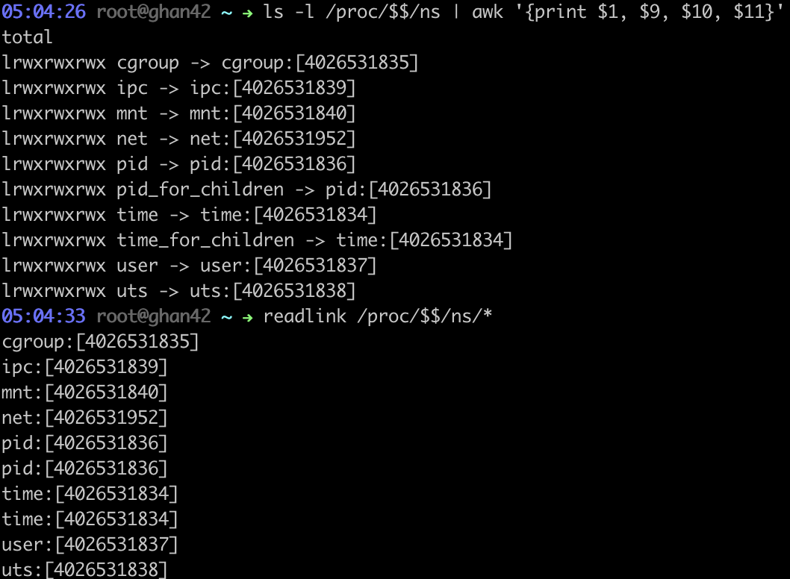
</p>
</figure>

- Normally, a namespace is automatically removed, when the last process in the namespace terminates or leaves the namespace. However, there are number of factors that keeps the namespace alive although there is no member processes. These factors can be checked in [Namespace lifetime section of namespaces man page](https://man7.org/linux/man-pages/man7/namespaces.7.html).

### Cgroup Namespace

- Each cgroup namespace has its root cgroup directory. A cgroup namespace makes the process to view its current cgroup directory as the root cgroup directory of the namespace. This virtualization of the process's view on its cgroup hierarchy can be seen in `/proc/[pid]/cgroup` and `/proc/[pid]/mountinfo`. Below is the example. The top shell shows how the `bash` process in a separate cgroup namespace recognizes its cgroup as the root. The bottom shell shows how the isolated shell's cgroup is seen in the original cgroup namespace.

<figure>
<p align="center">
  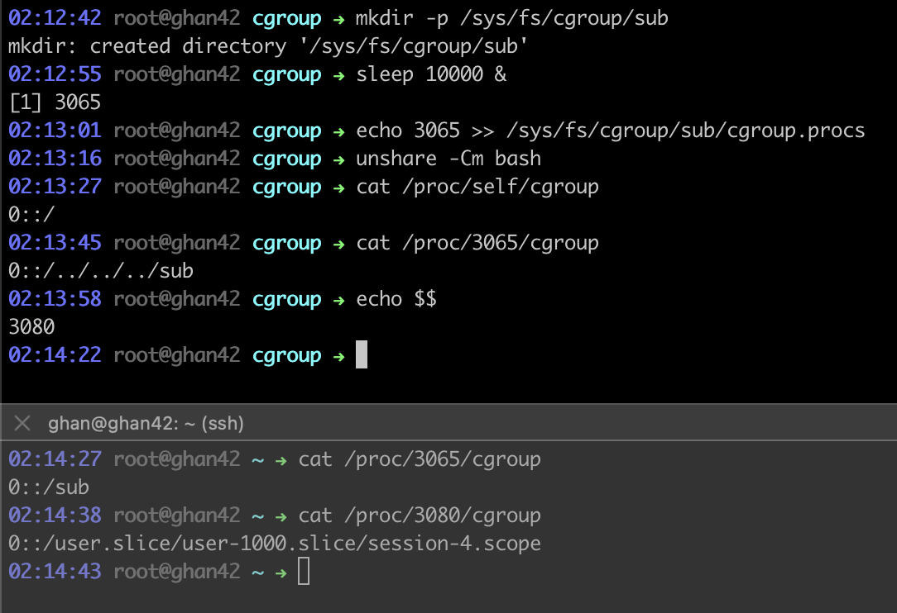
</p>
</figure>

- Advantages of using cgroup namespaces are:
  - It **prevents information leaks**. Processes inside the cgroup namespace cannot see cgroup directory paths outside of the namespace.
  - **Easy to migrate** containers since it is unnecessary to replicate the whole anscestral hierarchy of cgroup directory structure at the target location.
  - It prevents processes inside the namespace from escaping the limits imposed by ancestor cgroups.

#### What is a `cgroup`?

- `cgroup` stands for a control group. It is "a collection of processes that are bound to a set of limits or parameters defined via the cgroup filesystem." ([`cgroup` man page](https://man7.org/linux/man-pages/man7/cgroups.7.html))

- `cgroupfs` pseudo-filesystem provides the kernel's cgroup interface. The default path where the root cgroup directory is mounted on is `/sys/fs/cgroup`.

<figure>
<p align="center">
  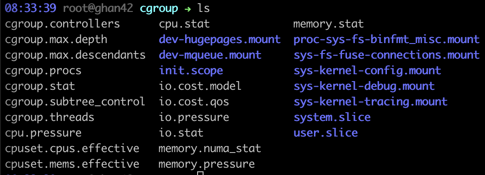
</p>
</figure>

- Just by `mkdir` sub-directory inside the root directory or one of sub-directories, a new cgroup can be created. Inside the new directory, cgroup configuration files are automatically created.

<figure>
<p align="center">
  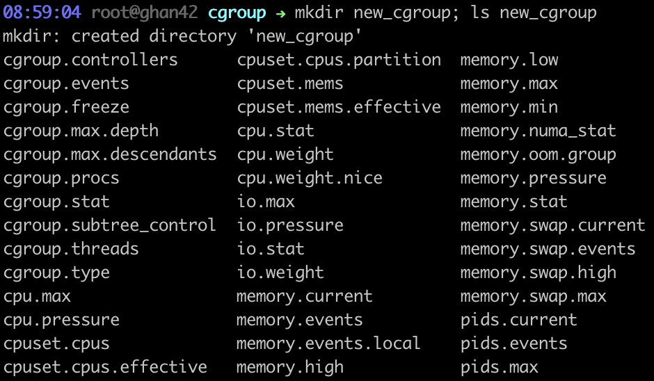
</p>
</figure>

- The `cgroup.procs` file lists PIDs of the processes inside the cgroup. By appending PID of a process to the target cgroup's `cgroup.procs` file, the process can be moved to the target cgroup.

<figure>
<p align="center">
  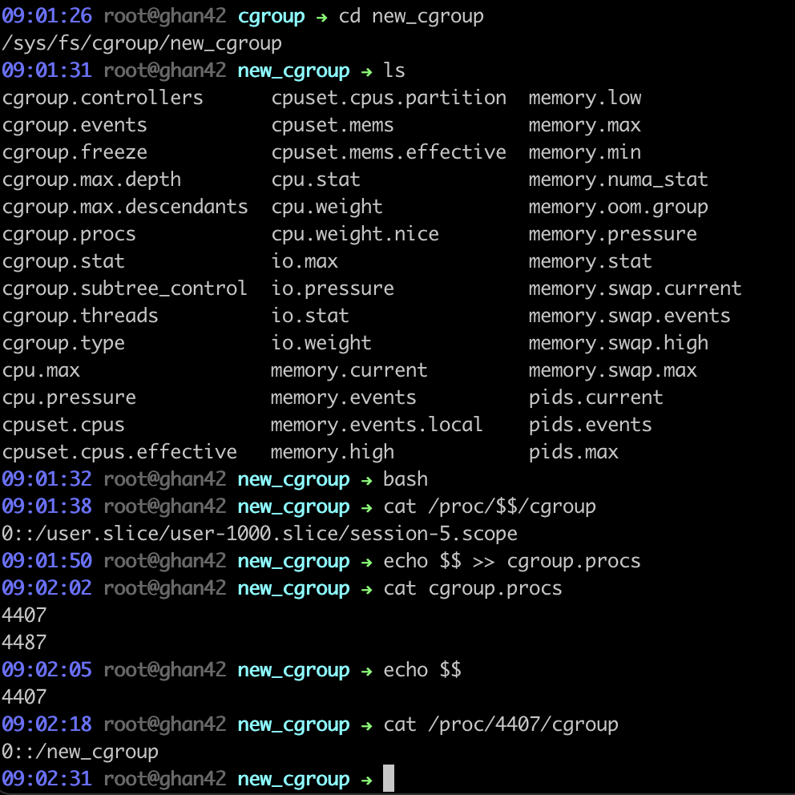
</p>
</figure>

- The "set of limits or parameters" on resources are defined in the files inside cgroup directories. See examples below.

<figure>
<p align="center">
  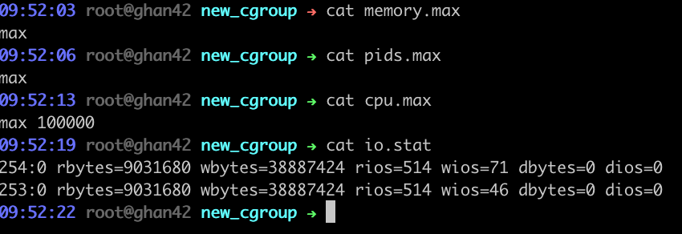
</p>
</figure>

- A list of available "subsystems" or "controllers", "kernel components that modifies the behaviour of the processes in a cgroup", are visible in the read-only file `cgroup.controllers`. The list matches that of the parent's `cgroup.subtree_control`.

<figure>
<p align="center">
  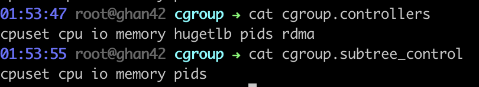
</p>
</figure>

- Cgroup controller types are (cgroup v2):

  - `cpu` - CPU usage
  - `cpuset` - CPUs and NUMA nodes binding
  - `freezer` - suspend and restore all processes in a cgroup
  - `hugetlb` - use of huge pages
  - `io` - IO control
  - `memory` - reporting and limiting of process memory, kernel memory, and swap used by cgroups
  - `perf_event` - performance monitoring
  - `pids` - number of processes
  - `rdma` - RDMA/IB-specific resources
  - There are more types in cgroup v1, for further details check [`cgroups` man page](https://man7.org/linux/man-pages/man7/cgroups.7.html).

- The tree structure of the root cgroup directory represents hierarchical cgroup structure of processes, which can be checked by `systemd-cgls` command. Sub-cgroup's limitations cannot exceed its parent's limitations.

<figure>
<p align="center">
  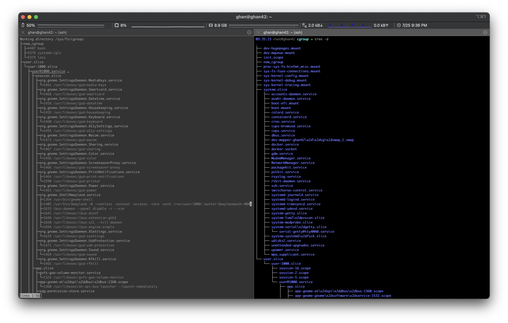
</p>
</figure>

- There are cgroup v1 and cgroup v2. There are a few differences between these two versions. Two major differences are explained in details below. Both versions are still supported and different controllers can be simultaneously mounted under the v1 and v2 hierarchies. For further details check [`cgroups` man page](https://man7.org/linux/man-pages/man7/cgroups.7.html).

  - In cgroups v1, different controllers can be mounted against different hierarchies. Such implementation was designed to allow flexibility for application design, however it only added complexity. Therefore, in cgroups v2, all controllers are mounted against a unified hierarchy (all mounted against the root cgroups).
  - cgroups v2 imposes "no internal processes" rule, which means processes can be assigned to only the root and leaf cgroups. In other words, a non-root cgroup cannot have member processes, and distribute resources into child cgroups at the same time. This makes relationship between the parent and the child explicit and intuitive.

- Thread level resource control is also possible via cgroups. This can be done by switching `cgroup.type`. For further details check [CGROUPS VERSION 2 THREAD MODE section of `cgroups` man page](https://man7.org/linux/man-pages/man7/cgroups.7.html).

### IPC Namespace

- IPC namespaces isolate [System V IPC objects](https://man7.org/linux/man-pages/man7/sysvipc.7.html) and POSIC message queues.
- Only the processes inside the same IPC namespace can see the IPC objects created in the namespace. The objects are invisible to processes outside the namespace.
- `/proc` interfaces distinct in each IPC namespace:
  - The POSIX message queue interfaces in `/proc/sys/fs/mqueue`.
  - The System V IPC interfaces in `/proc/sys/kernel`.
  - The System V IPC interfaces in `/proc/sysvipc`.

### Network Namespace

- Network namespaces isolate such networking resources:
  - network devices
  - IPv4 and IPv6 protocol stacks
  - IP routing tables
  - firewall rules
  - `/proc/net` directory
  - `sys/class/net` directory
  - various files under `/proc/sys/net`
  - port numbers (sockets)
  - the UNIX domain abstract socket namespace
- A physical network device can live in exactly one namespace.
- Pipe-like tunnels between namespaces and bridges to physical network devices can be created by [`veth`](https://man7.org/linux/man-pages/man4/veth.4.html).
- In the example below, two docker containers, both with Ubuntu images on and bash running, are running. The two containers are bound to the `docker0` bridge device via `veth` interfaces.

<figure>
<p align="center">
  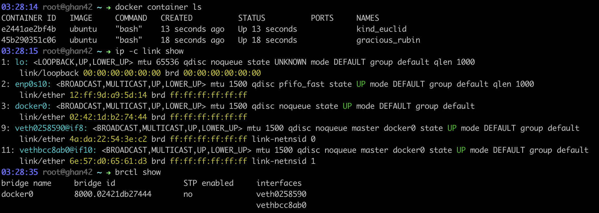
</p>
</figure>

- The running shell on one of the container's PID is 4899. Comparing contents of `/proc/[pid]/net/route`, `/proc/[pid]/net/socketstat` and `/proc/ns` files of processes in different namespaces shows that the process in a container, in a separate network namespace, owns its isolated network interfaces.

<figure>
<p align="center">
  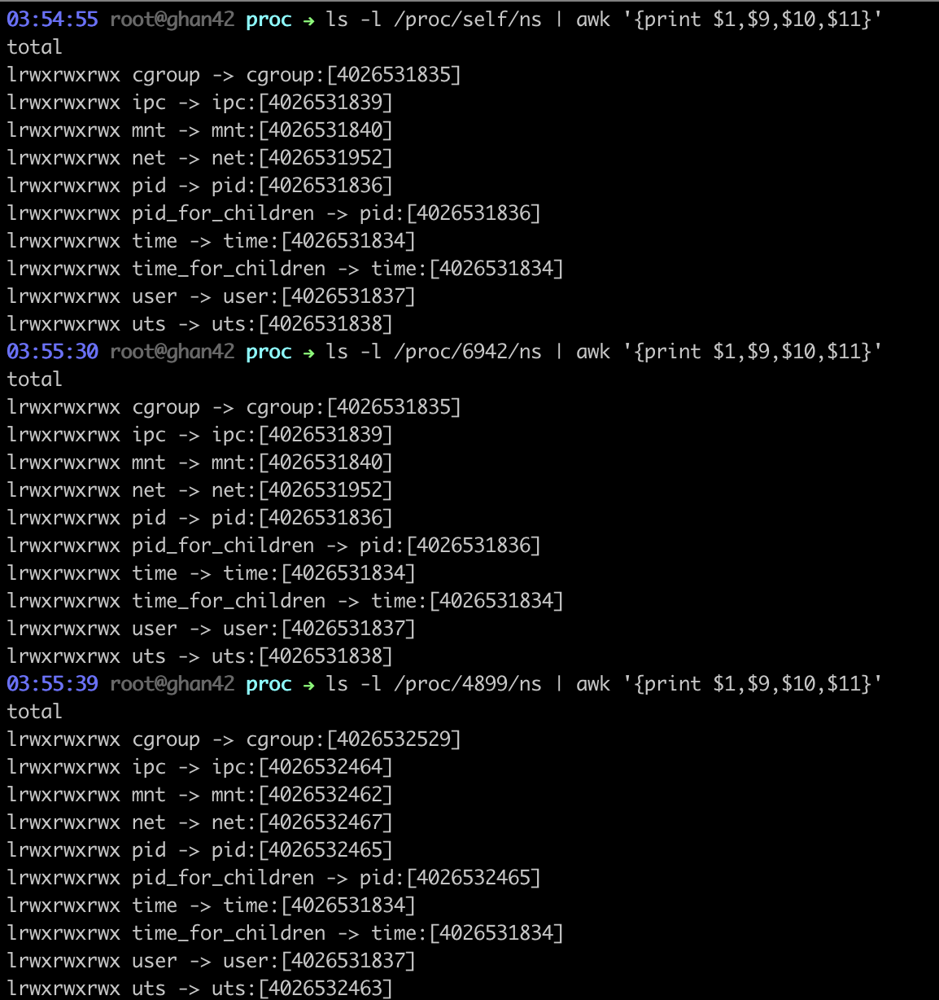
</p>
</figure>

<figure>
<p align="center">
  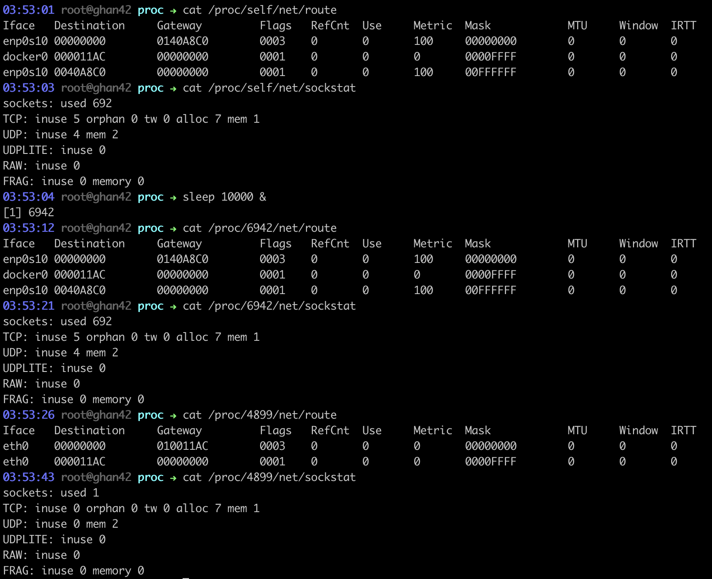
</p>
</figure>

### Mount Namespace

### PID Namespace

- PID namespaces isolate the process ID number space. Using the pid namespaces, containers can suspend/resume the set of processes and maintain the same PIDs after migrating into a new host since processes in different namespaces can have the same PID.
- PID 1 is allocated to the first process, so called the "init" process, created in a new namespace.

  - If the "init" process is terminated, all of the processes in the namespace receive `SIGKILL` and are terminated. Unless the "init" process is alive, a new process cannot be created in the namespace.
  - Only the signals that the "init" process handles can be sent from its chilren or processes in ancestor namespaces to the process. This limitation was set to prevent accidentally killing the "init" process. `SIGKILL` and `SIGSTOP` are exceptions when they are sent from ancestor namespaces. See the example below.

  <figure>
  <p align="center">
    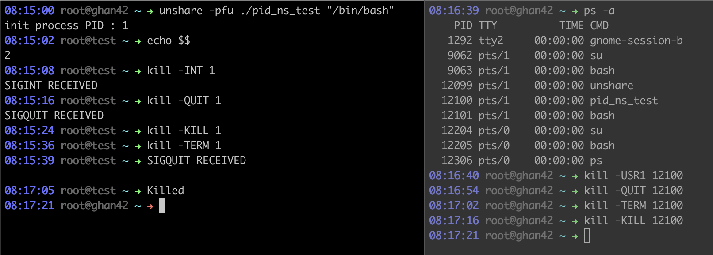
  </p>
  </figure>

  - Following is the source code of `pid_ns_test` executable

    ```C
    #include <unistd.h>
    #include <signal.h>
    #include <stdlib.h>
    #include <sys/types.h>
    #include <sys/wait.h>
    #include <stdio.h>

    void    handler(int signal) {
        if (signal == SIGINT)
            printf("SIGINT RECEIVED\n");
        else if (signal == SIGQUIT)
            printf("SIGQUIT RECEIVED\n");
    }

    int main(int argc, char **argv, char **envp) {
        if (argc == 1) {
            write(STDERR_FILENO, "Wrong args\n", 11);
            return 1;
        }
        if (sethostname("test", 4) == -1)
            write(STDERR_FILENO, "Failed to set hostname\n", 23);
        printf("init process PID : %d\n", getpid());
        signal(SIGINT, handler);
        signal(SIGQUIT, handler);
        char **args = calloc(2, sizeof(char *));
        args[0] = argv[1];
        pid_t pid = fork();
        if (!pid && execve(argv[1], args, envp) == -1) {
            write(STDERR_FILENO, "Failed to execute shell\n", 24);
            return 1;
        }
        waitpid(pid, NULL, 0);
        return 0;
    }
    ```

- PID namespaces can be nested, thus form a tree. Each PID namespace has a parent namespace, except for the very first PID namespace.

  - A process is visible to other processes in its PID namespace and ancestor namespaces. But a process in a child namespace cannot see processes in its ancestor namespaces.
  - `getpid` returns PID associated with the namespace in which the function was called.
  - Processes may freely descend into a child PID namespace, but they cannot ascend to ancestor namespaces.
  - The example below shows nested structure of PID namespaces. The processes in the child namespace are visible, although are identified by different PIDs in different namespaces, by the processes in its own namespace and the ancestor namespace. (Top : a pid namespace created by unshare; Bottom : a pid namespace created by a docker container)

  <figure>
  <p align="center">
    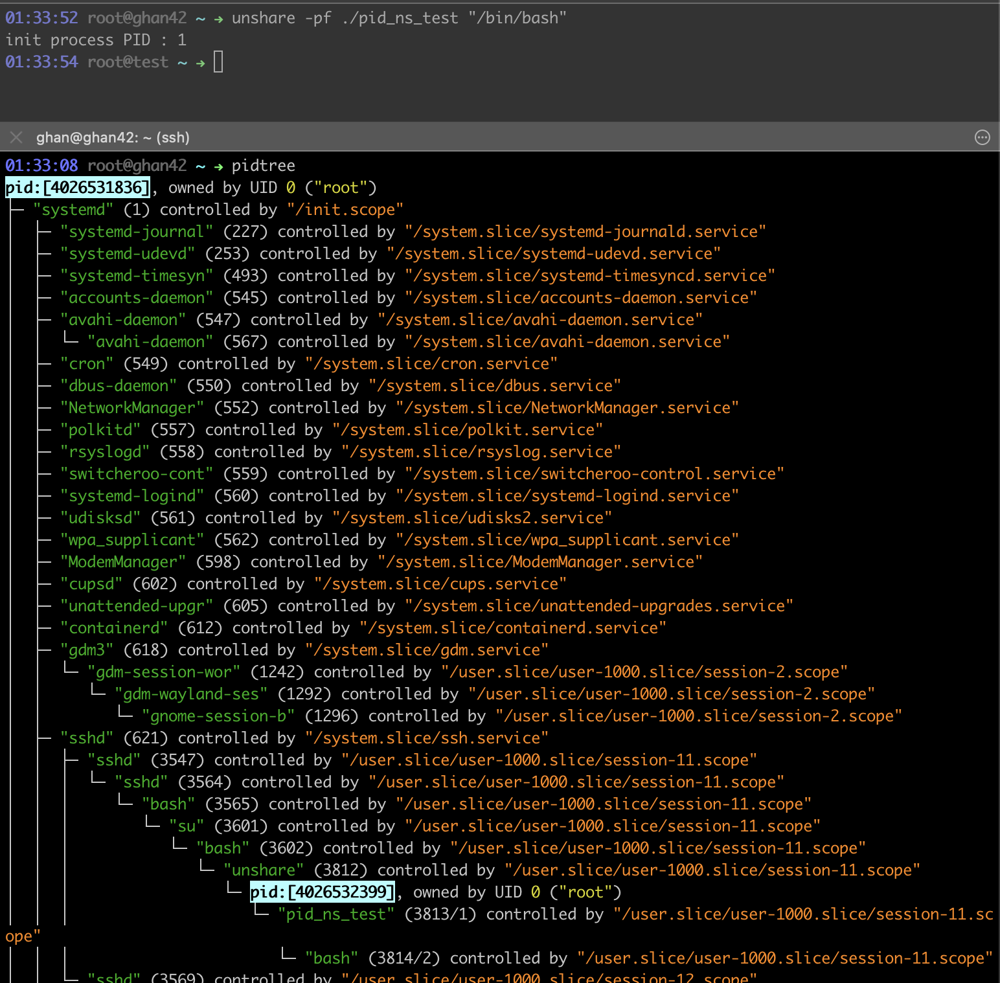
  </p>
  </figure>

  <figure>
  <p align="center">
    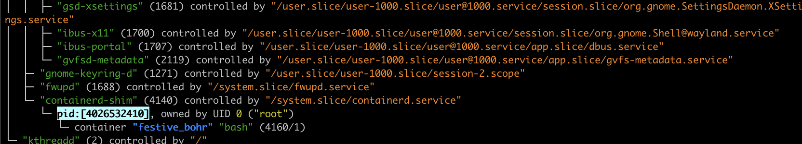
  </p>
  </figure>

- Orphaned children are adopted to the "init" process of the PID namespace.
- `/proc` filesystem only shows processes in the PID namespace of the process that perfomed the mount. Therefore it is necessary to mount a new `procfs` at `/proc` in the new namespace in order to use `ps` correctly and see `/proc` files regarding the processes in the namespace.

### Time Namespace

- Time namespaces virtualize the values of `CLOCK_MONOTONIC` and `CLOCK_BOOTTIME`.
  - `CLOCK_MONOTONIC` : represents time in seconds since the system was booted (in Linux), excluding intervals for while the system was suspended.
  - `CLOCK_BOOTTIME` : identical to `CLOCK_MONOTONIC`, but it includes suspended intervals as well.
- The created namespace does not put the calling process in the namespace, but the subsequently created children of the calling processs.
- Note that docker containers share the same time namespace as the host. PID 3758 is of a bash shell inside a container.

<figure>
  <p align="center">
    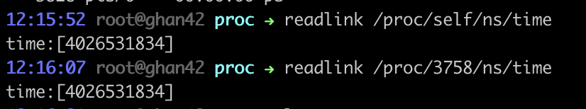
  </p>
  </figure>

### User Namespace

- User namespaces isolate security-related identifiers and attributes: [user IDs, group IDs](https://man7.org/linux/man-pages/man7/credentials.7.html), the root directory, [keys](https://man7.org/linux/man-pages/man7/keyrings.7.html), and [capabilities](https://man7.org/linux/man-pages/man7/capabilities.7.html).
- User and group IDs of a process may be different inside and outside a user namespace. In the example below (process, user, mount namespaces are created), an UID (GID) `1000` in the outer namespace is mapped to a privileged UID (GID) `0` in the inner namespace. The normal user outside is regarded as the root, privileged, user inside. But the privileges are limited to opertions on resources inside the namespace. Note that even though the username is read `root`, the user cannot access `/root` which belongs to the outer namespace.

  <figure>
  <p align="center">
    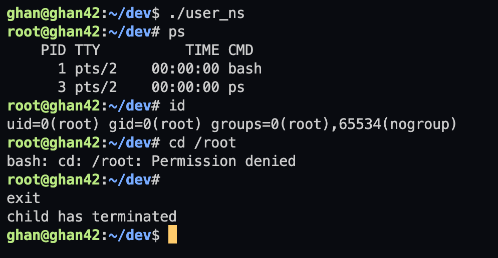
  </p>
  </figure>

  ```C
  // source code for `user_ns` binary
  #define _GNU_SOURCE
  #include <errno.h>
  #include <fcntl.h>
  #include <sched.h>
  #include <stdio.h>
  #include <stdlib.h>
  #include <string.h>
  #include <sys/mman.h>
  #include <sys/mount.h>
  #include <sys/wait.h>
  #include <unistd.h>

  #define STACK_SIZE (1024 * 1024)

  void err_exit(char *errmsg) {
    if (errmsg) {
      write(STDERR_FILENO, errmsg, strlen(errmsg));
      write(STDERR_FILENO, "\n", 1);
    }
    exit(EXIT_FAILURE);
  }

  int child_fn(void *arg) {
    char *args[2];
    char path[20];
    int fd;

    if (mount("proc", "/proc", "proc", 0, "") == -1) err_exit("mount error");
    bzero(path, 20);
    sprintf(path, "/proc/%d/uid_map", getpid());
    fd = open(path, O_RDWR);
    if (fd < 0) err_exit("open error");
    if (write(fd, "0 1000 1\n", 14) != 14) err_exit("uid write error");
    close(fd);
    bzero(path, 20);
    sprintf(path, "/proc/%d/setgroups", getpid());
    fd = open(path, O_RDWR);
    if (fd < 0) err_exit("open error");
    if (write(fd, "deny\n", 5) != 5) err_exit("setgroups write error");
    close(fd);
    bzero(path, 20);
    sprintf(path, "/proc/%d/gid_map", getpid());
    fd = open(path, O_RDWR);
    if (fd < 0) err_exit("open error");
    if (write(fd, "0 1000 1\n", 14) != 14) err_exit("gid write error");
    close(fd);
    args[0] = "/bin/bash";
    args[1] = NULL;
    if (execvp("/bin/bash", args) == -1) err_exit("exec error");
    return EXIT_SUCCESS;
  }

  int main(void) {
    char *stack;
    char *stack_top;
    pid_t child_pid;

    stack = mmap(NULL, STACK_SIZE, PROT_READ | PROT_WRITE,
                MAP_PRIVATE | MAP_ANONYMOUS | MAP_STACK, -1, 0);
    if (stack == MAP_FAILED) err_exit("mmap error");
    stack_top = stack + STACK_SIZE;
    child_pid = clone(child_fn, stack_top,
                      CLONE_NEWUSER | CLONE_NEWPID | CLONE_NEWNS | SIGCHLD, NULL);
    if (child_pid == -1) err_exit("clone error");
    if (waitpid(child_pid, NULL, 0) == -1) err_exit("waitpid error");
    printf("child has terminated\n");
    return EXIT_SUCCESS;
  }
  ```

- User namespaces can be nested. Each process belongs to exactly one user namespace.
- Unprivileged processes can create user namespaces while other namespaces can only be created by processes with `CAP_SYS_ADMIN`. When `CLONE_NEWUSER` is specified along with other `CLONE_NEW*` flags when calling `clone` or `unshare`, a new user namespace is guaranteed to be created first, so that even unprivileged processes can create combinations of namespaces.
- The child process created by `clone` with the `CLONE_NEWUSER` flag, `unshare`, or `setns` (entering existing user namespace) are given a complete set of capabilites in the new user namespace. However, even if the new namespace is created by the root, the process has no capabilities in outer namespaces. Note that calling `execve` causes recalculation of a process's capabilites as described in the [man page on capabilites](https://man7.org/linux/man-pages/man7/capabilities.7.html).

  - In the example below, the `bash` shell process in the new namespace is given the full set of capabilites. Note that the process that called `clone` is owned by an unprivileged user `1000` in the outer namespace.

  <figure>
  <p align="center">
    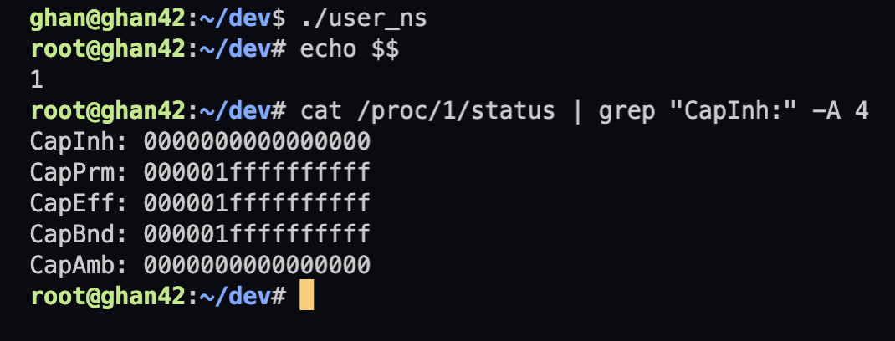
  </p>
  </figure>

- Only the "initial" user namespace can perform operations on resources that are not associated with any namespace, such as changing the system time, loading a kernel module, and creating a device etc. If the process in a new user namespace owns its PID namespace, it can mount `/proc` filesystems.
- When a user namespace is created, UID nor GID are mapped as shown in the image below. By writing 1-to-1 mapping of UIDs on `/proc/[pid]/uid_map` and GIDs on `/proc/[pid]/gid_map`, following the format and the rules specified on the man page, the process in the new namespace can be mapped to a user in the outer namespace.
  - Note that these files can be written only once.
  - Before writing gid mapping on a `.../gid_map` file, "deny" must be written on the target process's `/proc/[pid]/setgroups` file.

<figure>
<p align="center">
  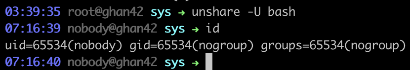
</p>
</figure>

- File access permissions are determined depending on the process credentials and the file credentials of the initial user namespace.

### UTS Namespace

- UTS namespace isolates the hostname and the NIS domain name. Changes to these identifiers are visible only to the processes in the same namespace.
- In the example below, via `nsenter` wrapper the shell outside a docker container enters the UTS namespace of the container.

<figure>
<p align="center">
  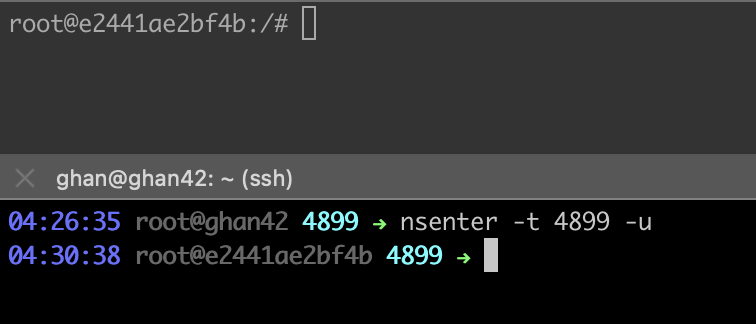
</p>
</figure>

### `nsenter`

## `chroot`

# Docker

# References

## Debian & Alpine Linux

- [Debian changing language](https://wiki.debian.org/ChangeLanguage)
- [Debian locale setting](https://wiki.debian.org/Locale)
- [Linux man pages online](https://man7.org/linux/man-pages/index.html)

## Docker & Containers

- [Grunert, S. (2019). Demystifying Containers - Part I: Kernel Space. [online] Medium.](https://medium.com/@saschagrunert/demystifying-containers-part-i-kernel-space-2c53d6979504)
