# Inception

System administration by using Docker containers

# Index

# Virtual Machine Network (VirtualBox)

- This section explains how virtual machines, specifically the machines that are run by VirtualBox, communicate with each other and outside world via network.

## NAT with Port Forwarding
- NAT is a default network mode for VirtualBox VMs.
- The Oracle VM VirtualBox networking engine acts as a router between VMs and the host. It is positioned between each VM and the host, and maps traffic from and to a VM transparently.
- VMs cannot talk to each other.
- VM -> outside - the TCP/IP data of the network frames sent out by a VM is replaced by the data of the host OS. - Other applications in and out of the host machine, sees the traffic as if it has been originated from the VirtualBox application.
- outside -> VM - once the VirtualBox receives a reply, it repacks and resends it to the guest machine on its private network.
- In order to allow the host machine or machines over the net to talk to VMs, port forwarding must be set, such that VirtualBox may listen to certain ports on the host, and resend the packets that arrive there to the guest's port.

## Network Address Translation Service
- NAT Service acts as a home router allowing VMs to talk with each other (via the internal network) and the outside (not directly but with help of port forwarding) by using TCP and UDP over IPv4 and IPv6.

## Bridged Networking
- The VirtualBox uses a device driver on the host system to filter data from the physical network adaptorand inject data into it. It effectively creates a new network interface in software.
- When a guest uses the interface, the host system sees it as if the guest were physically connected to the interface by a cable. VMs can send data to the host and receive data form the host.

## Internal Networking
- The same as [the bridged networking](#bridged-networking), but it allows only communication between VMs. Since there is no physical adaptor attached, packets cannot be intercepted, thus it has security advantages over bridged network.
- It ensures private communication between VMs.

## Host-only Networking
- A hybrid between the bridged and internal networking modes. There is no physical adaptor.
- The VirtualBox creates a new software loopback interface by which VMs can communicate with the host, but not with the outside.
- The VMs can still communicate with each other privately over the internal network.

# Linux (Debian & Alpine)

## VM Set-up
- Execute [the setup script](./vm_setup.sh).

- How to support secondary language (Korean)

  - Execute the following command, and choose the preferred language

  ```
  dpkg-reconfigure locales
  ```

  - `export LANG=ko_KR.UTF_8`
  - Install the language's font. (Install `nanum` font)

  ```
  apt-get install fonts-nanum fonts-nanum-coding fonts-nanum-extra
  ```

  - reboot

- [How to install Docker Engine on a linux machine](https://docs.docker.com/engine/install/ubuntu/) (follow the instruction on the link)

## Alpine vs. Debian or Else on Containers

### Base Image vs. Distroless
- Container images can be built either by using a base image of a Linux distribution, or building from scratch (called distroless container images).
- Even though the distroless images take much less storage space and provide access to the latest packages, freedom to customize comes with responsiblity. The developer will need to update libraries, fix security vulnerabilities on his own. Updating dependencies and libraries may lead to frequent incompatibility issues in code which  ultimately may countervail improvement in efficiency achieved by small storage space.
- On the other hand, by using a base image, developers can save their time and focus on an application running in a container by relying on efforts of Linux maintainers. Downside is that the final image becomes larger due to all sorts of dependencies, compared to distroless images.

### Choosing the Best Base Image
- Each Linux distribution has a different set of Pros and Cons. Alpine offers the smallest size, but uses less popular libc, muslc. RedHat stream OSs offer the best security and support, but is relatively large in size. These differences are explained in details in [this article](https://crunchtools.com/comparison-linux-container-images/).
- Although it is important, bare size cannot be the only measure for choosing the base image. Some argue that having less dependencies, in case of Alpine Linux, expose less attack surface, and therefore offers better security. The others, the RedHat stream, argue that assessment must be made [on the whole eco-system scale](https://www.redhat.com/en/blog/container-tidbits-can-good-supply-chain-hygiene-mitigate-base-image-sizes), and disadvantages in size can be mitigated by build caches.

### Alpine Linux
- For this project, Alpine and Debian are given as options, and Alpine was chosen for following reasons:
  - Alpine is much lighter than Debian (busybox instead of GNU Core Utils, musl libc instead of glibc). Size matters when images are distributed to rated cloud services (Nick shows price comparison in his [article](https://nickjanetakis.com/blog/the-3-biggest-wins-when-using-alpine-as-a-base-docker-image)).
    <figure>
      <p align="center">
        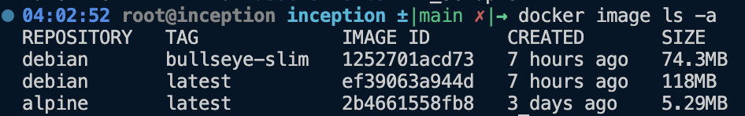
      </p>
    </figure>
  - Alpine's package manager `apk` automatically cleans up packages while debian requires an additional command (`apt-get clean`) to be executed.
  - Alpine exposes less attack surface.
  - Alpine is more intriguing.

# Container Basics

## What is a Container?

```
"A container is a standard unit of software that packages up code and all its dependencies so the application runs quickly and reliably from one computing environment to another." - docker.com
```

- The quotation above is a definition of a container, in terms of its functionalities, that Docker provides to its customers.
- Below the surface, if a container is viewed from an implementer's angle, it can be explained as an "isolated group of processes on a single host." (Grunert, 2019)
- The next question arises: "how are the processes grouped and is the group isolated?" Following sections will try to answer this question by explaining the basic operations and concepts of Linux (`namespaces` and `chroot`), on which the containerization techniques are based on.

## Linux `namespaces`

- A **namespace** wraps a global system resouce in an abstraction so that the processes within the namespace may see themselves as if they have their own isolated instance of the global resource.
- Only the member processes of the namespace can see any changes to the global resource.
- Following are the namespace types, resouces in the parentheses after each type indicate resouces that are isolated by each type, avaliable on Linux:
  - [`Cgroup`](#cgroup-namespace)(cgroup root directory)
  - [`IPC`](#ipc-namespace)(system V IPC, POSIX message queues)
  - [`Network`](#network-namespace)(etwork devices, stacks, ports, etc.)
  - [`Mount`](#mount-namespace)(mount points)
  - [`PID`](#pid-namespace)(process IDs)
  - [`Time`](#time-namespace)(boot and monotonic clocks)
  - [`User`](#user-namespace)(user and group IDs)
  - [`UTS`](#uts-namespace)(hostname and NIS domain name)
- Changes to the namespace of a process can be made by following system call APIs:
  - [`clone`](https://man7.org/linux/man-pages/man2/clone.2.html)
  - [`setns`](https://man7.org/linux/man-pages/man2/setns.2.html)
  - [`unshare`](https://man7.org/linux/man-pages/man2/unshare.2.html)
  - [`ioctl`](https://man7.org/linux/man-pages/man2/ioctl.2.html)
- Namespaces of each process can be checked inside the `/proc/[pid]/ns/` directory.
<figure>
<p align="center">
  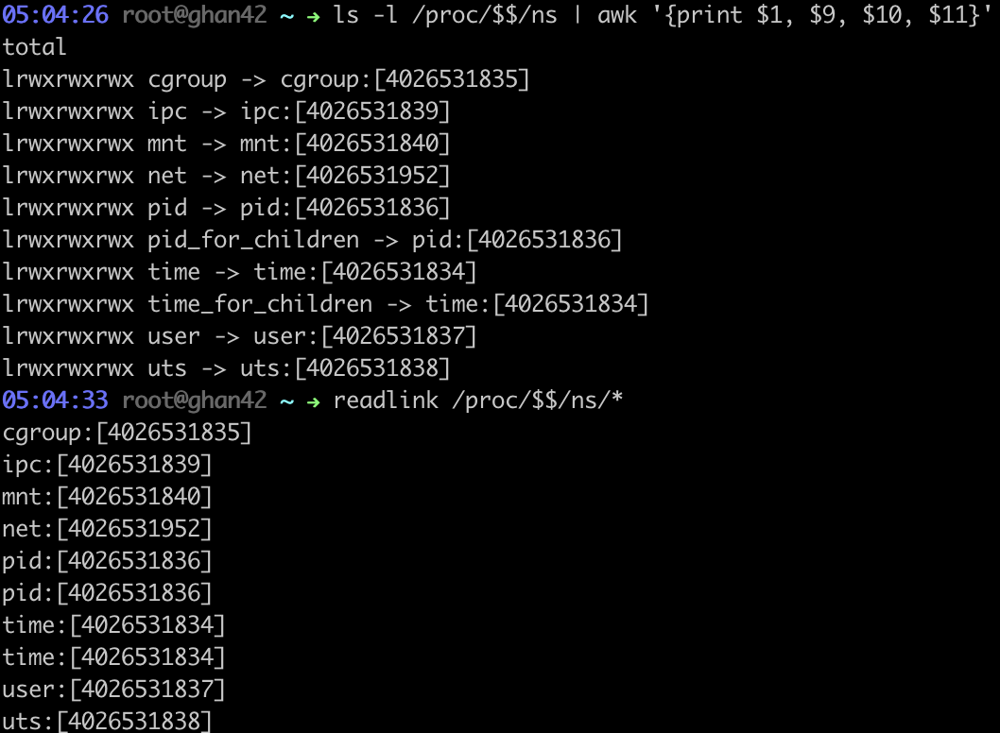
</p>
</figure>

- Normally, a namespace is automatically removed, when the last process in the namespace terminates or leaves the namespace. However, there are number of factors that keeps the namespace alive although there is no member processes. These factors can be checked in [Namespace lifetime section of namespaces man page](https://man7.org/linux/man-pages/man7/namespaces.7.html).

### Cgroup Namespace

- Each cgroup namespace has its root cgroup directory. A cgroup namespace makes the process to view its current cgroup directory as the root cgroup directory of the namespace. This virtualization of the process's view on its cgroup hierarchy can be seen in `/proc/[pid]/cgroup` and `/proc/[pid]/mountinfo`. Below is the example. The top shell shows how the `bash` process in a separate cgroup namespace recognizes its cgroup as the root. The bottom shell shows how the isolated shell's cgroup is seen in the original cgroup namespace.

<figure>
<p align="center">
  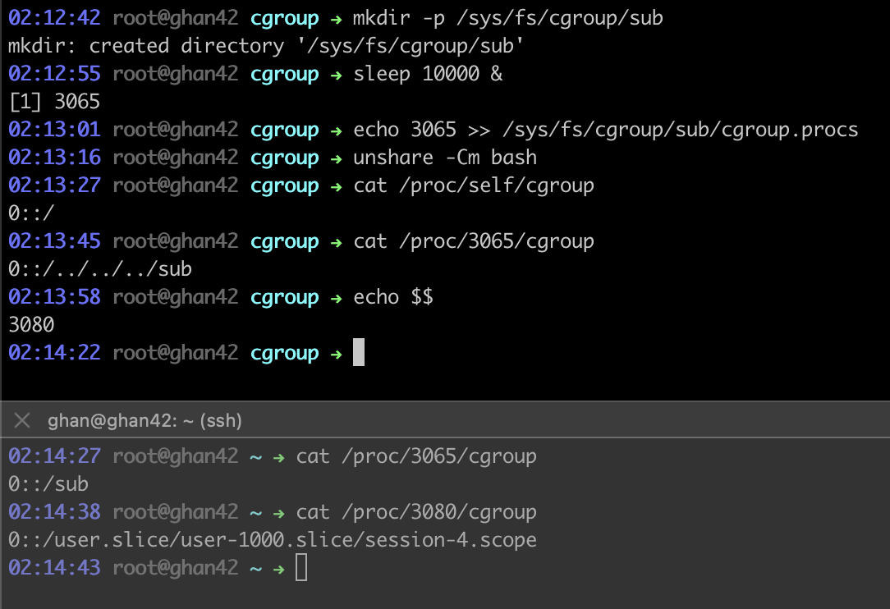
</p>
</figure>

- Advantages of using cgroup namespaces are:
  - It **prevents information leaks**. Processes inside the cgroup namespace cannot see cgroup directory paths outside of the namespace.
  - **Easy to migrate** containers since it is unnecessary to replicate the whole anscestral hierarchy of cgroup directory structure at the target location.
  - It prevents processes inside the namespace from escaping the limits imposed by ancestor cgroups.

#### What is a `cgroup`?

- `cgroup` stands for a control group. It is "a collection of processes that are bound to a set of limits or parameters defined via the cgroup filesystem." ([`cgroup` man page](https://man7.org/linux/man-pages/man7/cgroups.7.html))

- `cgroupfs` pseudo-filesystem provides the kernel's cgroup interface. The default path where the root cgroup directory is mounted on is `/sys/fs/cgroup`.

<figure>
<p align="center">
  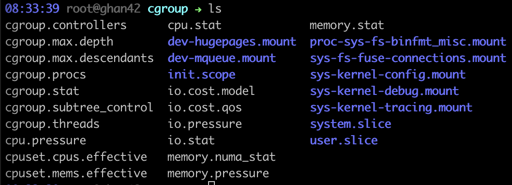
</p>
</figure>

- Just by `mkdir` sub-directory inside the root directory or one of sub-directories, a new cgroup can be created. Inside the new directory, cgroup configuration files are automatically created.

<figure>
<p align="center">
  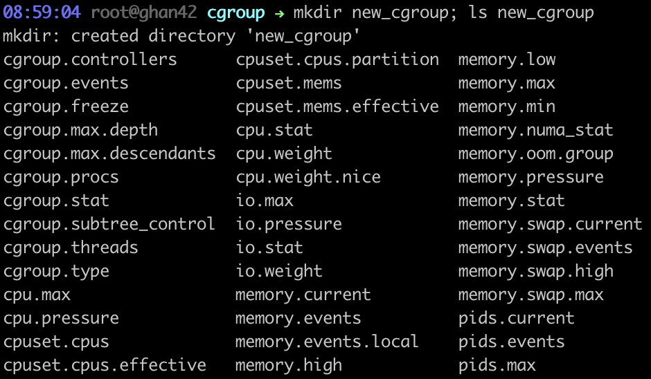
</p>
</figure>

- The `cgroup.procs` file lists PIDs of the processes inside the cgroup. By appending PID of a process to the target cgroup's `cgroup.procs` file, the process can be moved to the target cgroup.

<figure>
<p align="center">
  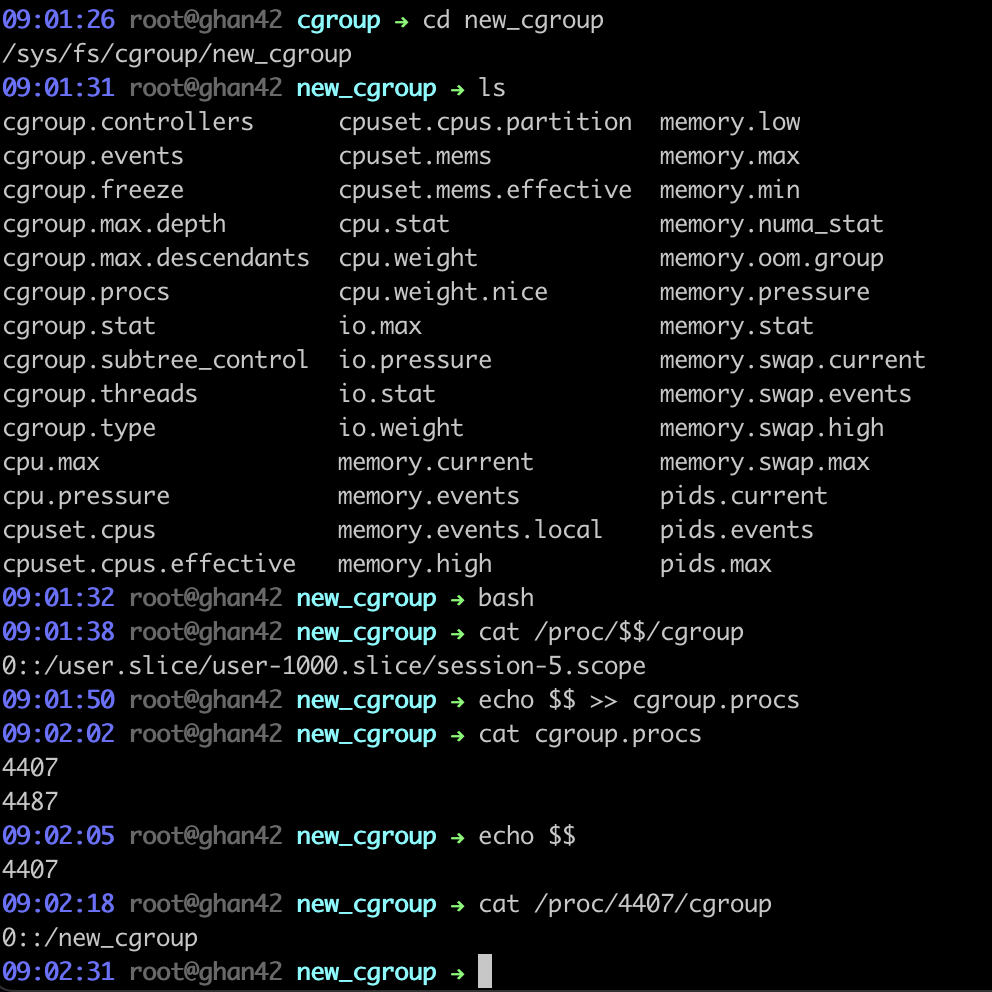
</p>
</figure>

- The "set of limits or parameters" on resources are defined in the files inside cgroup directories. See examples below.

<figure>
<p align="center">
  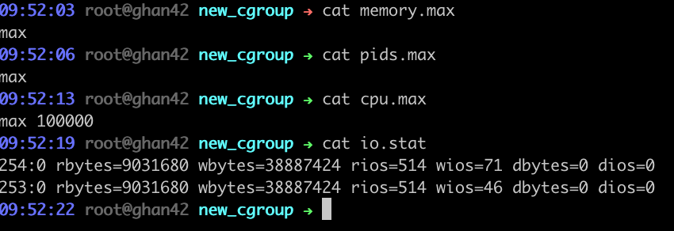
</p>
</figure>

- A list of available "subsystems" or "controllers", "kernel components that modifies the behaviour of the processes in a cgroup", are visible in the read-only file `cgroup.controllers`. The list matches that of the parent's `cgroup.subtree_control`.

<figure>
<p align="center">
  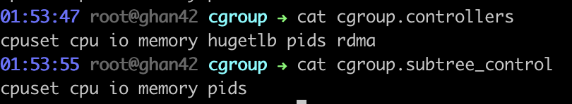
</p>
</figure>

- Cgroup controller types are (cgroup v2):

  - `cpu` - CPU usage
  - `cpuset` - CPUs and NUMA nodes binding
  - `freezer` - suspend and restore all processes in a cgroup
  - `hugetlb` - use of huge pages
  - `io` - IO control
  - `memory` - reporting and limiting of process memory, kernel memory, and swap used by cgroups
  - `perf_event` - performance monitoring
  - `pids` - number of processes
  - `rdma` - RDMA/IB-specific resources
  - There are more types in cgroup v1, for further details check [`cgroups` man page](https://man7.org/linux/man-pages/man7/cgroups.7.html).

- The tree structure of the root cgroup directory represents hierarchical cgroup structure of processes, which can be checked by `systemd-cgls` command. Sub-cgroup's limitations cannot exceed its parent's limitations.

<figure>
<p align="center">
  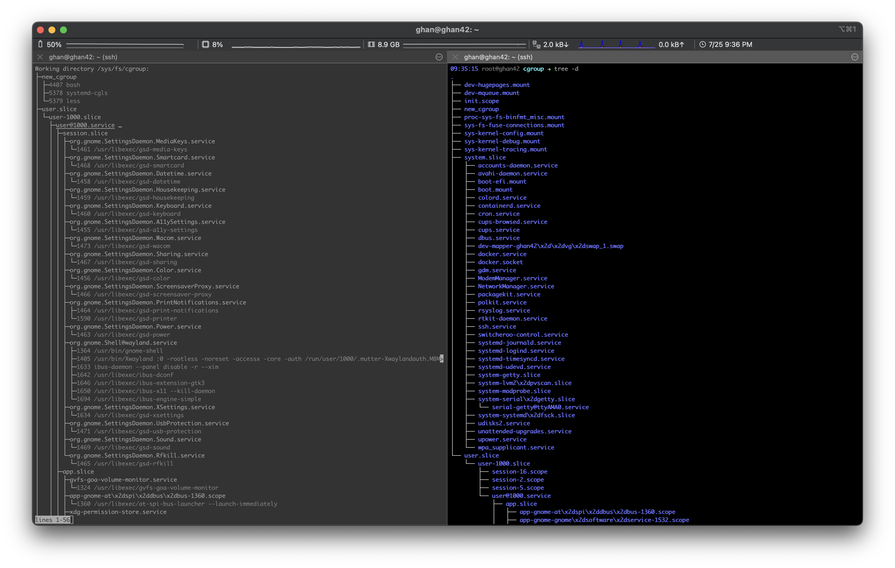
</p>
</figure>

- There are cgroup v1 and cgroup v2. There are a few differences between these two versions. Two major differences are explained in details below. Both versions are still supported and different controllers can be simultaneously mounted under the v1 and v2 hierarchies. For further details check [`cgroups` man page](https://man7.org/linux/man-pages/man7/cgroups.7.html).

  - In cgroups v1, different controllers can be mounted against different hierarchies. Such implementation was designed to allow flexibility for application design, however it only added complexity. Therefore, in cgroups v2, all controllers are mounted against a unified hierarchy (all mounted against the root cgroups).
  - cgroups v2 imposes "no internal processes" rule, which means processes can be assigned to only the root and leaf cgroups. In other words, a non-root cgroup cannot have member processes, and distribute resources into child cgroups at the same time. This makes relationship between the parent and the child explicit and intuitive.

- Thread level resource control is also possible via cgroups. This can be done by switching `cgroup.type`. For further details check [CGROUPS VERSION 2 THREAD MODE section of `cgroups` man page](https://man7.org/linux/man-pages/man7/cgroups.7.html).

### IPC Namespace

- IPC namespaces isolate [System V IPC objects](https://man7.org/linux/man-pages/man7/sysvipc.7.html) and POSIC message queues.
- Only the processes inside the same IPC namespace can see the IPC objects created in the namespace. The objects are invisible to processes outside the namespace.
- `/proc` interfaces distinct in each IPC namespace:
  - The POSIX message queue interfaces in `/proc/sys/fs/mqueue`.
  - The System V IPC interfaces in `/proc/sys/kernel`.
  - The System V IPC interfaces in `/proc/sysvipc`.

### Network Namespace

- Network namespaces isolate such networking resources:
  - network devices
  - IPv4 and IPv6 protocol stacks
  - IP routing tables
  - firewall rules
  - `/proc/net` directory
  - `sys/class/net` directory
  - various files under `/proc/sys/net`
  - port numbers (sockets)
  - the UNIX domain abstract socket namespace
- A physical network device can live in exactly one namespace.
- Pipe-like tunnels between namespaces and bridges to physical network devices can be created by [`veth`](https://man7.org/linux/man-pages/man4/veth.4.html).
- In the example below, two docker containers, both with Ubuntu images on and bash running, are running. The two containers are bound to the `docker0` bridge device via `veth` interfaces.

<figure>
<p align="center">
  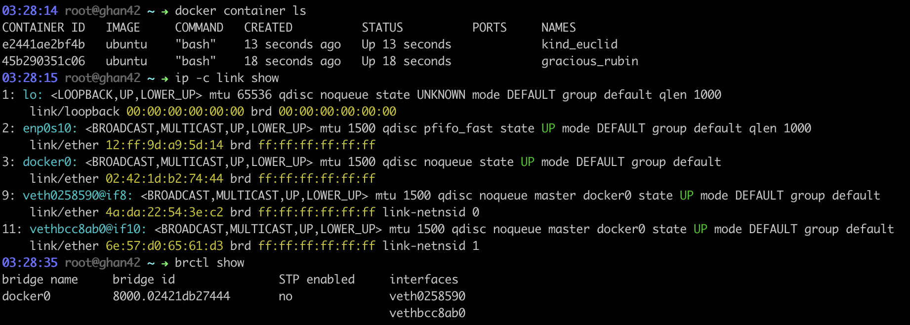
</p>
</figure>

- The running shell on one of the container's PID is 4899. Comparing contents of `/proc/[pid]/net/route`, `/proc/[pid]/net/socketstat` and `/proc/ns` files of processes in different namespaces shows that the process in a container, in a separate network namespace, owns its isolated network interfaces.

<figure>
<p align="center">
  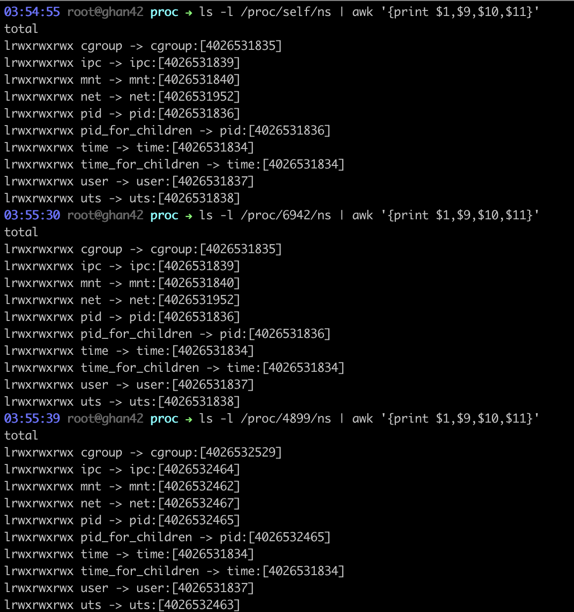
</p>
</figure>

<figure>
<p align="center">
  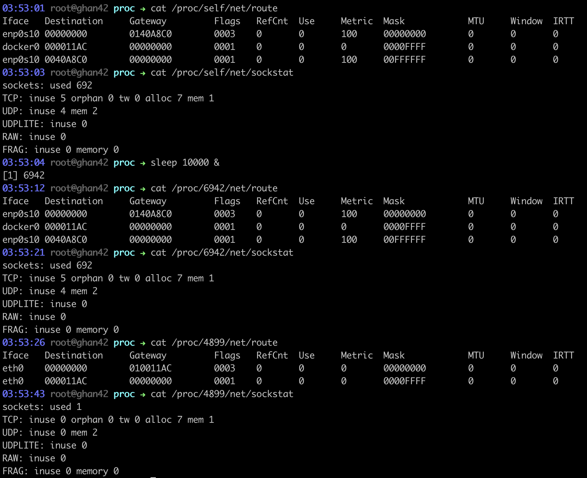
</p>
</figure>

### Mount Namespace

- Mount namespaces isolates the list of mounts seen by the processes in each namespace. Therefore, the processes in each namespace will see distinct directory hierarchies. The distinct view can be seen in `/proc/[pid]/mounts`, `/proc/[pid]/mountinfo`, and `/proc/[pid]/mountstats` files.. All processes in the same mount namespace see the same view in these files.
- Mount namespaces are created by using `clone` ore `unshare` with `CLONE_NEWNS` flag.
  - if `clone`, the child namespace's mount list is a copy of the parent process's mount list.
  - else if `unshare`, the child namespace's mount list is a copy of the caller's mount list.
- By default, modifications on mount lists of either the parent namespace or the child namespace do not affect each other. But, after the implementaion of mount namespaces, some cases where the complete isolation were too great were found. For example, a mount operation was required in each namespace in order to make a newly loaded optical drive visible to all namespaces.
- In order to minimize repetitive mounting for the complete isolation issue, the shared subtree feature was introduced. This feature allows "automatic, controlled propagation of mount and unmount events between namespaces." ([`mount namespaces` man page](https://man7.org/linux/man-pages/man7/mount_namespaces.7.html)) Each mount is marked with one of the following propagation types (per-mount-point setting):
  - `MS_SHARED` : events propagate to members of a peer group; conversely, events under peer mounts propagate to this mount.
  - `MS_PRIVATE` : no peer group, no propagation.
  - `MS_SLAVE` : propagate into this mount from a shared peer group; events under this mount do not propagate to any peer. This type is useful when it is needed to make events from the master peer group to propagate to the slave mount, while preventing propagations in reverse direction.
  - `MS_UNBINDABLE` : like a private mount, also can't be bind mount.
    - This type exists in order to avoid "mount explosion" problem when performing bind mounts of a higher-level subtree at a lower-level mount. For further details, see [MS_UNBIND example section of man page](https://man7.org/linux/man-pages/man7/mount_namespaces.7.html).
- A member is added to the mount "peer group" in which the existing mount is when:
  - the mount is marked as shared;
  - the mount is copied during the creation of a new namespace;
  - a new bind mount.'
- The propagation type of each mount can be checked via the "optional fields" in `/proc/[pid]/mountinfo`.
  - `shared:X` for shared mount in peer group X.
  - `master:X` for a slave mount to shared peer group X.
  - `propagate_from:X` for a slave and receiveds propagtion from shared peer group X when the process cannot see the save's immediate master.
  - `unbindable`
  - No tags mean private mounts.
- Below is an example of how propagations occur between different mount namespaces depending on different mount propagation types (shared & private).

<figure>
<p align="center">
  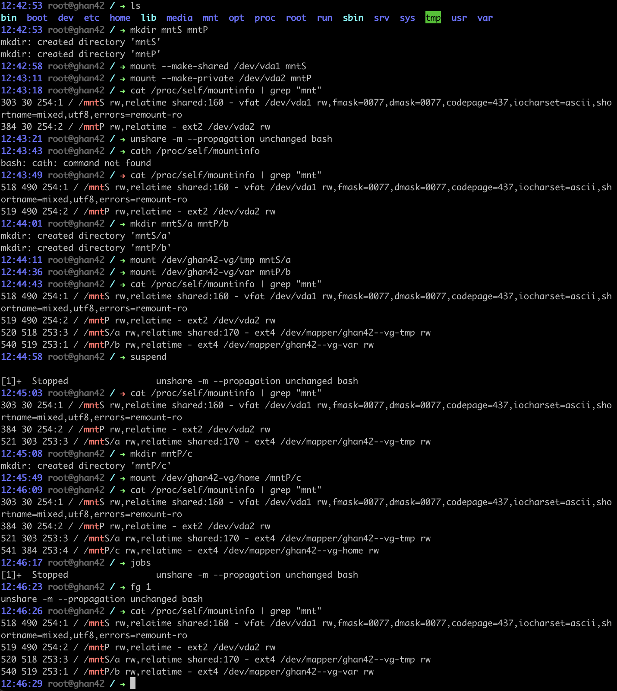
</p>
</figure>

### PID Namespace

- PID namespaces isolate the process ID number space. Using the pid namespaces, containers can suspend/resume the set of processes and maintain the same PIDs after migrating into a new host since processes in different namespaces can have the same PID.
- PID 1 is allocated to the first process, so called the "init" process, created in a new namespace.

  - If the "init" process is terminated, all of the processes in the namespace receive `SIGKILL` and are terminated. Unless the "init" process is alive, a new process cannot be created in the namespace.
  - Only the signals that the "init" process handles can be sent from its chilren or processes in ancestor namespaces to the process. This limitation was set to prevent accidentally killing the "init" process. `SIGKILL` and `SIGSTOP` are exceptions when they are sent from ancestor namespaces. See the example below.

  <figure>
  <p align="center">
    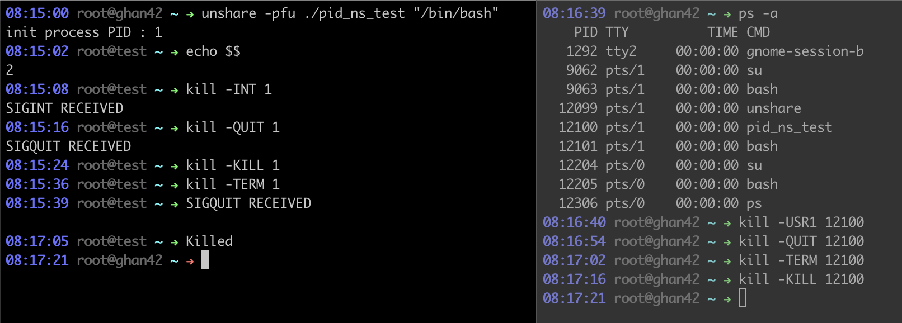
  </p>
  </figure>

  - Following is the source code of `pid_ns_test` executable

    ```C
    #include <unistd.h>
    #include <signal.h>
    #include <stdlib.h>
    #include <sys/types.h>
    #include <sys/wait.h>
    #include <stdio.h>

    void    handler(int signal) {
        if (signal == SIGINT)
            printf("SIGINT RECEIVED\n");
        else if (signal == SIGQUIT)
            printf("SIGQUIT RECEIVED\n");
    }

    int main(int argc, char **argv, char **envp) {
        if (argc == 1) {
            write(STDERR_FILENO, "Wrong args\n", 11);
            return 1;
        }
        if (sethostname("test", 4) == -1)
            write(STDERR_FILENO, "Failed to set hostname\n", 23);
        printf("init process PID : %d\n", getpid());
        signal(SIGINT, handler);
        signal(SIGQUIT, handler);
        char **args = calloc(2, sizeof(char *));
        args[0] = argv[1];
        pid_t pid = fork();
        if (!pid && execve(argv[1], args, envp) == -1) {
            write(STDERR_FILENO, "Failed to execute shell\n", 24);
            return 1;
        }
        waitpid(pid, NULL, 0);
        return 0;
    }
    ```

- PID namespaces can be nested, thus form a tree. Each PID namespace has a parent namespace, except for the very first PID namespace.

  - A process is visible to other processes in its PID namespace and ancestor namespaces. But a process in a child namespace cannot see processes in its ancestor namespaces.
  - `getpid` returns PID associated with the namespace in which the function was called.
  - Processes may freely descend into a child PID namespace, but they cannot ascend to ancestor namespaces.
  - The example below shows nested structure of PID namespaces. The processes in the child namespace are visible, although are identified by different PIDs in different namespaces, by the processes in its own namespace and the ancestor namespace. (Top : a pid namespace created by unshare; Bottom : a pid namespace created by a docker container)

  <figure>
  <p align="center">
    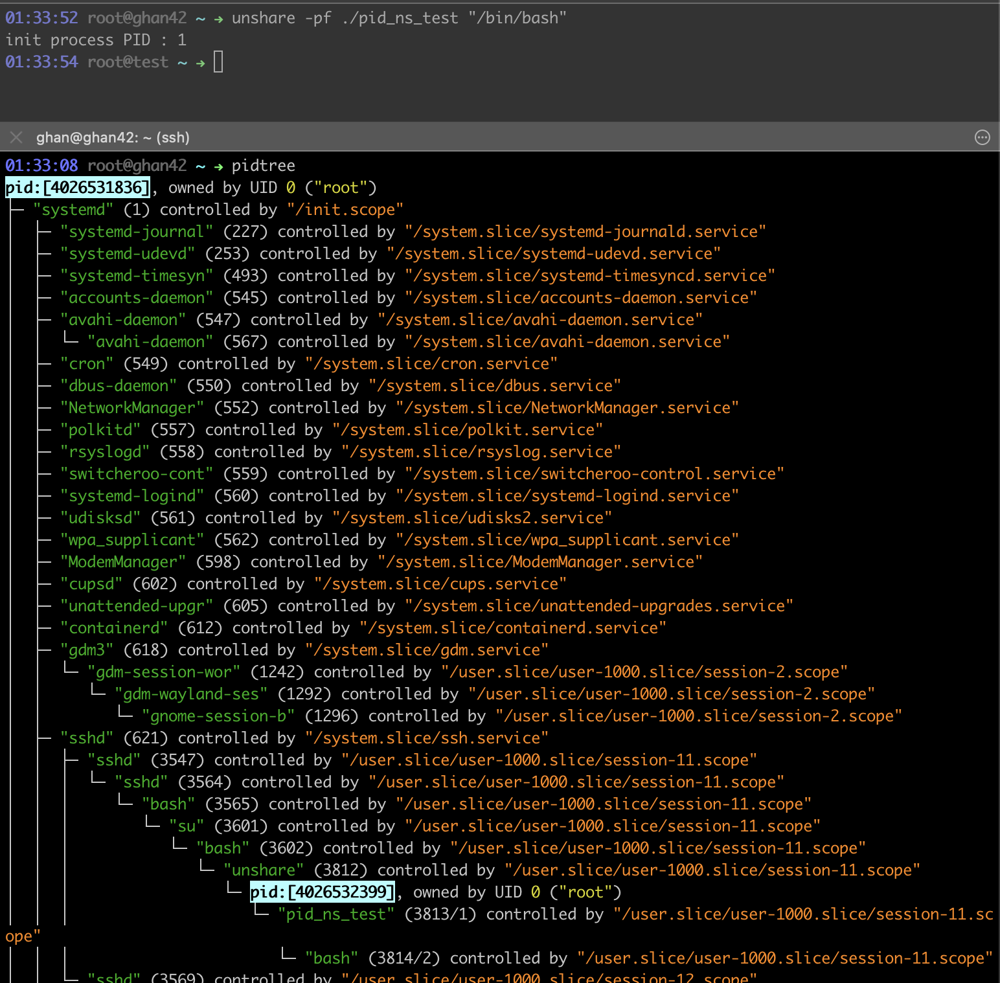
  </p>
  </figure>

  <figure>
  <p align="center">
    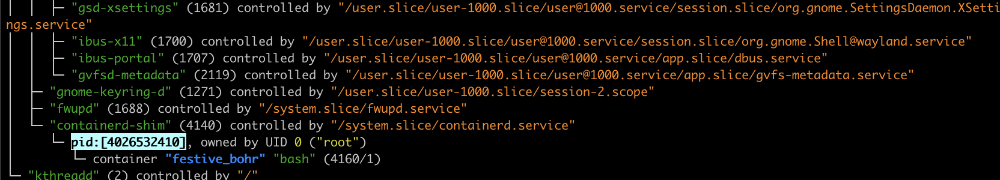
  </p>
  </figure>

- Orphaned children are adopted to the "init" process of the PID namespace.
- `/proc` filesystem only shows processes in the PID namespace of the process that perfomed the mount. Therefore it is necessary to mount a new `procfs` at `/proc` in the new namespace in order to use `ps` correctly and see `/proc` files regarding the processes in the namespace.

### Time Namespace

- Time namespaces virtualize the values of `CLOCK_MONOTONIC` and `CLOCK_BOOTTIME`.
  - `CLOCK_MONOTONIC` : represents time in seconds since the system was booted (in Linux), excluding intervals for while the system was suspended.
  - `CLOCK_BOOTTIME` : identical to `CLOCK_MONOTONIC`, but it includes suspended intervals as well.
- The created namespace does not put the calling process in the namespace, but the subsequently created children of the calling processs.
- Note that docker containers share the same time namespace as the host. PID 3758 is of a bash shell inside a container.

<figure>
  <p align="center">
    
  </p>
  </figure>

### User Namespace

- User namespaces isolate security-related identifiers and attributes: [user IDs, group IDs](https://man7.org/linux/man-pages/man7/credentials.7.html), the root directory, [keys](https://man7.org/linux/man-pages/man7/keyrings.7.html), and [capabilities](https://man7.org/linux/man-pages/man7/capabilities.7.html).
- User and group IDs of a process may be different inside and outside a user namespace. In the example below (process, user, mount namespaces are created), an UID (GID) `1000` in the outer namespace is mapped to a privileged UID (GID) `0` in the inner namespace. The normal user outside is regarded as the root, privileged, user inside. But the privileges are limited to opertions on resources inside the namespace. Note that even though the username is read `root`, the user cannot access `/root` which belongs to the outer namespace.

  <figure>
  <p align="center">
    
  </p>
  </figure>

  ```C
  // source code for `user_ns` binary
  #define _GNU_SOURCE
  #include <errno.h>
  #include <fcntl.h>
  #include <sched.h>
  #include <stdio.h>
  #include <stdlib.h>
  #include <string.h>
  #include <sys/mman.h>
  #include <sys/mount.h>
  #include <sys/wait.h>
  #include <unistd.h>

  #define STACK_SIZE (1024 * 1024)

  void err_exit(char *errmsg) {
    if (errmsg) {
      write(STDERR_FILENO, errmsg, strlen(errmsg));
      write(STDERR_FILENO, "\n", 1);
    }
    exit(EXIT_FAILURE);
  }

  int child_fn(void *arg) {
    char *args[2];
    char path[20];
    int fd;

    if (mount("proc", "/proc", "proc", 0, "") == -1) err_exit("mount error");
    bzero(path, 20);
    sprintf(path, "/proc/%d/uid_map", getpid());
    fd = open(path, O_RDWR);
    if (fd < 0) err_exit("open error");
    if (write(fd, "0 1000 1\n", 14) != 14) err_exit("uid write error");
    close(fd);
    bzero(path, 20);
    sprintf(path, "/proc/%d/setgroups", getpid());
    fd = open(path, O_RDWR);
    if (fd < 0) err_exit("open error");
    if (write(fd, "deny\n", 5) != 5) err_exit("setgroups write error");
    close(fd);
    bzero(path, 20);
    sprintf(path, "/proc/%d/gid_map", getpid());
    fd = open(path, O_RDWR);
    if (fd < 0) err_exit("open error");
    if (write(fd, "0 1000 1\n", 14) != 14) err_exit("gid write error");
    close(fd);
    args[0] = "/bin/bash";
    args[1] = NULL;
    if (execvp("/bin/bash", args) == -1) err_exit("exec error");
    return EXIT_SUCCESS;
  }

  int main(void) {
    char *stack;
    char *stack_top;
    pid_t child_pid;

    stack = mmap(NULL, STACK_SIZE, PROT_READ | PROT_WRITE,
                MAP_PRIVATE | MAP_ANONYMOUS | MAP_STACK, -1, 0);
    if (stack == MAP_FAILED) err_exit("mmap error");
    stack_top = stack + STACK_SIZE;
    child_pid = clone(child_fn, stack_top,
                      CLONE_NEWUSER | CLONE_NEWPID | CLONE_NEWNS | SIGCHLD, NULL);
    if (child_pid == -1) err_exit("clone error");
    if (waitpid(child_pid, NULL, 0) == -1) err_exit("waitpid error");
    printf("child has terminated\n");
    return EXIT_SUCCESS;
  }
  ```

- User namespaces can be nested. Each process belongs to exactly one user namespace.
- Unprivileged processes can create user namespaces while other namespaces can only be created by processes with `CAP_SYS_ADMIN`. When `CLONE_NEWUSER` is specified along with other `CLONE_NEW*` flags when calling `clone` or `unshare`, a new user namespace is guaranteed to be created first, so that even unprivileged processes can create combinations of namespaces.
- The child process created by `clone` with the `CLONE_NEWUSER` flag, `unshare`, or `setns` (entering existing user namespace) are given a complete set of capabilites in the new user namespace. However, even if the new namespace is created by the root, the process has no capabilities in outer namespaces. Note that calling `execve` causes recalculation of a process's capabilites as described in the [man page on capabilites](https://man7.org/linux/man-pages/man7/capabilities.7.html).

  - In the example below, the `bash` shell process in the new namespace is given the full set of capabilites. Note that the process that called `clone` is owned by an unprivileged user `1000` in the outer namespace.

  <figure>
  <p align="center">
    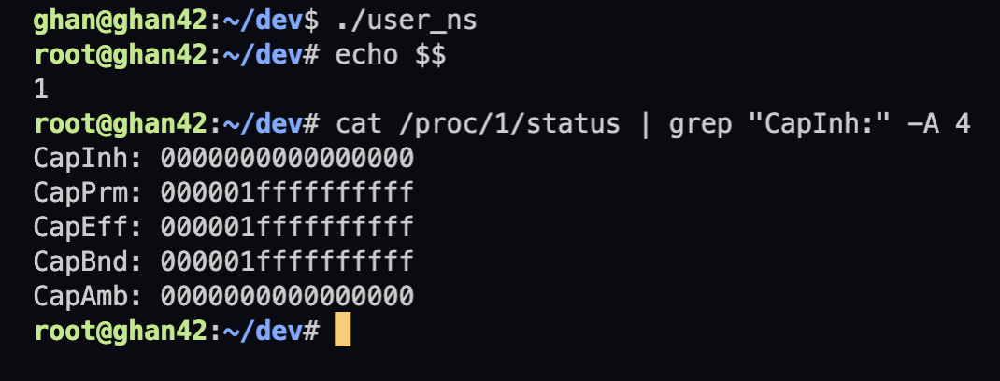
  </p>
  </figure>

- Only the "initial" user namespace can perform operations on resources that are not associated with any namespace, such as changing the system time, loading a kernel module, and creating a device etc. If the process in a new user namespace owns its PID namespace, it can mount `/proc` filesystems.
- When a user namespace is created, UID nor GID are mapped as shown in the image below. By writing 1-to-1 mapping of UIDs on `/proc/[pid]/uid_map` and GIDs on `/proc/[pid]/gid_map`, following the format and the rules specified on the man page, the process in the new namespace can be mapped to a user in the outer namespace.
  - Note that these files can be written only once.
  - Before writing gid mapping on a `.../gid_map` file, "deny" must be written on the target process's `/proc/[pid]/setgroups` file.

<figure>
<p align="center">
  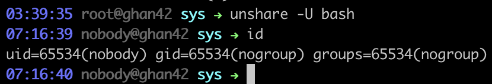
</p>
</figure>

- File access permissions are determined depending on the process credentials and the file credentials of the initial user namespace.

### UTS Namespace

- UTS namespace isolates the hostname and the NIS domain name. Changes to these identifiers are visible only to the processes in the same namespace.
- In the example below, via `nsenter` wrapper the shell outside a docker container enters the UTS namespace of the container.

<figure>
<p align="center">
  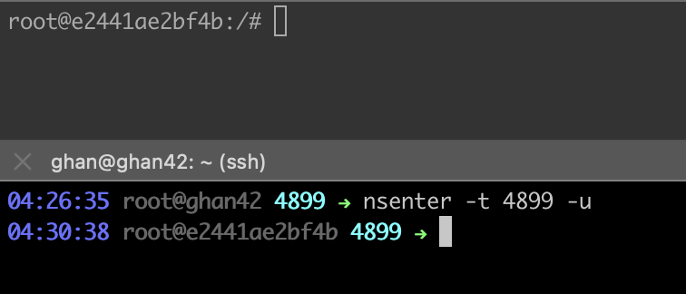
</p>
</figure>

## `chroot` & `pivot_root`

- Along with namespaces, changing root directory by `chroot` or `pivot_root` are used in order to create isolated environments for containers.
- `chroot` is a system call that changes the root directory(`/`) of the calling process to the given path. A privileged process with `CAP_SYS_CHROOT` can call `chroot`.

  ```C
  // C prototype
  #include <unistd.h>
  int chroot(const char *path);

  // User command
  // if no command specified, /bin/bash is called by default
  chroot [OPTION] NEWROOT [COMMAND [ARG]...]
  chroot OPTION
  ```

  - All children of the calling process share the same root directory.
  - `chroot` is not intended to be used for security purpose since it cannot completely sandbox the process. It only changes the pathname of the root directory from the calling process's point of view.
  - The "jail" created by `chroot` can easily escaped by just moving directories and then opening paths outside the root.

  <figure>
  <p align="center">
    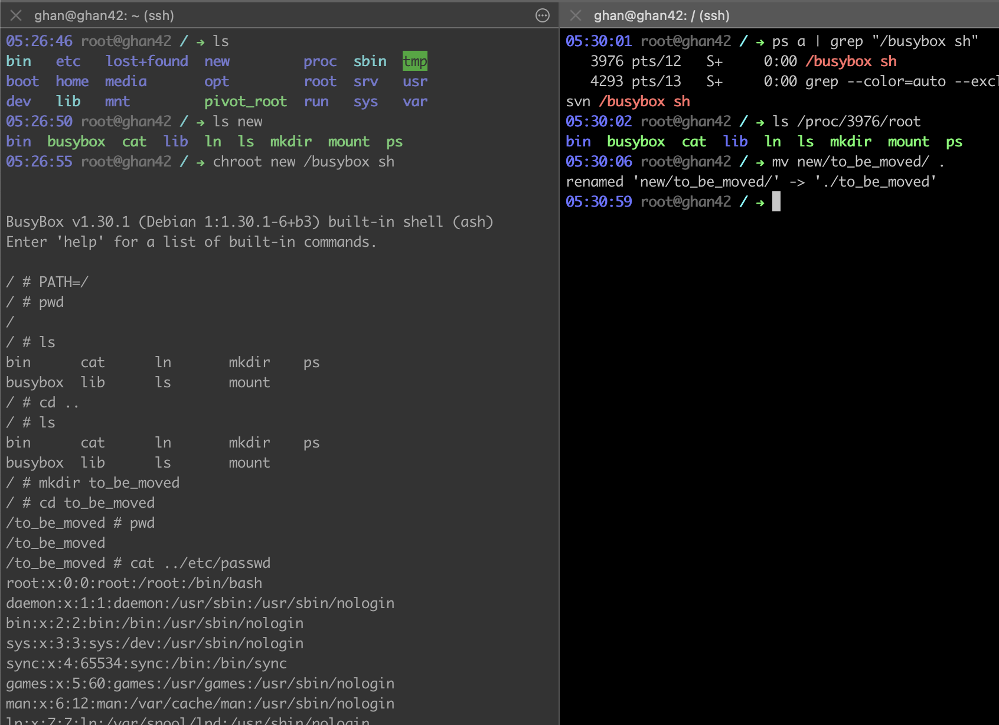
  </p>
  </figure>

  - As shown in the example above and below, a process's root directory can be checked in the symbolic link `/proc/[pid]/root`. Each process has a different root path, first the initial root, second the `chroot`ed process, third the shell inside a docker container.

  <figure>
  <p align="center">
    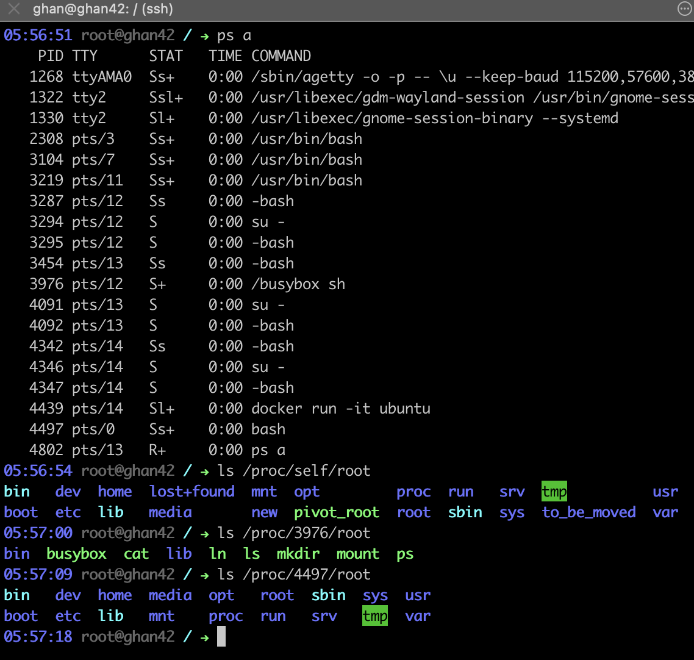
  </p>
  </figure>

  - Note that the executable for the command which will be executed after `chroot` and its dependencies must be present in the `new_root` directory prior to `chroot` call.

- On the other hand, the system call `pivot_root` not only changes the root directory, but also changes the root mount in the mount namespace of the calling process. (It moves the original root mount to the directory `put_old` and makes the `new_root` the new root mount). It requires `CAP_SYS_ADMIN` capability in the user namespace that owns the caller's mount namespace.

  ```C
  // C prototype
  #include <sys/syscall.h>      /* Definition of SYS_* constants */
  #include <unistd.h>
  int syscall(SYS_pivot_root, const char *new_root, const char *put_old);

  // User command
  pivot_root new_root put_old
  ```

  - Restrictions are:
    - `new_root` and `put_old` must be directories.
    - `new_root` and `put_old` must not be on the same mount as the current root.
    - `put_old` must be a sub directory of `new_root`. Therefore, the old rootfs can be unmounted after pivoting by calling `umount put_old`.
    - `new_root` must be a path to a mount point. By using bind mount, a normal directory can turn into a mount point.
    - The current root directory must be a mount point.
    - The propagation type of the parent mount of `new_root` and the parent mount of the current root directory must not be `MS_SHARED`. Unless, pivoting may affect other mount namespaces.
  - Following code and photograph is an example of `pivot_root`.

  <figure>
  <p align="center">
    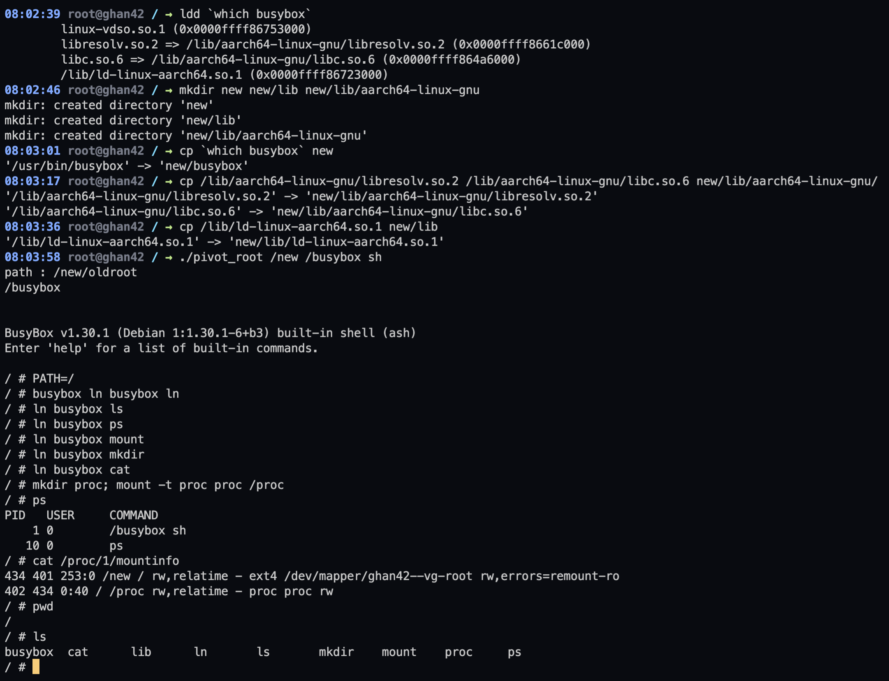
  </p>
  </figure>

  ```C
  #define _GNU_SOURCE
  #include <sched.h>
  #include <stdio.h>
  #include <stdlib.h>
  #include <unistd.h>
  #include <sys/wait.h>
  #include <sys/syscall.h>
  #include <sys/mount.h>
  #include <sys/stat.h>
  #include <limits.h>
  #include <sys/mman.h>
  #include <string.h>

  #define STACK_SIZE (1024 * 1024)

  void error_exit(char *err_msg) {
    perror(err_msg);
    exit(EXIT_FAILURE);
  }

  static int child(void *arg) {
    char **args = arg;
    char *new_root = args[0];
    char path[PATH_MAX];

    if (mount(NULL, "/", NULL, MS_REC | MS_PRIVATE, NULL) == -1)
      error_exit("mount private");
    if (mount(new_root, new_root, NULL, MS_BIND, NULL) == -1)
      error_exit("mount bind");
    bzero(path, PATH_MAX);
    snprintf(path, sizeof(path), "%s/%s", new_root, "oldroot");
    printf("path : %s\n", path);
    if (mkdir(path, 0777) == -1)
      error_exit("mkdir");
    if (syscall(SYS_pivot_root, new_root, path) == -1)
      error_exit("pivot_root");
    if (chdir("/") == -1)
      error_exit("chdir");
    if (umount2("/oldroot", MNT_DETACH) == -1)
      error_exit("umount2");
    if (rmdir("/oldroot") == -1)
      error_exit("rmdir");
    printf("%s\n", args[1]);
    execv(args[1], &args[1]);
    error_exit("execv");
  }

  int main(int argc, char *argv[]) {
    char *stack = mmap(NULL, STACK_SIZE, PROT_READ | PROT_WRITE,
                    MAP_PRIVATE | MAP_ANONYMOUS | MAP_STACK, -1, 0);
    if (stack == MAP_FAILED)
      error_exit("mmap");
    // CREATE CHILD PROCESS IN A NEW MOUNT NAMESPACE
    if (clone(child, stack + STACK_SIZE, CLONE_NEWNS | CLONE_NEWPID | SIGCHLD, &argv[1]) == -1)
      error_exit("clone");
    if (wait(NULL) == -1)
      error_exit("wait");
    return EXIT_SUCCESS;
  }
  ```

  - Since the new root is mounted inside a new mount namespace, `pivot_root` provides much secure isolation than `chroot`. `pivot_root` jail cannot be easily escaped like the `chroot` jail.

  <figure>
  <p align="center">
    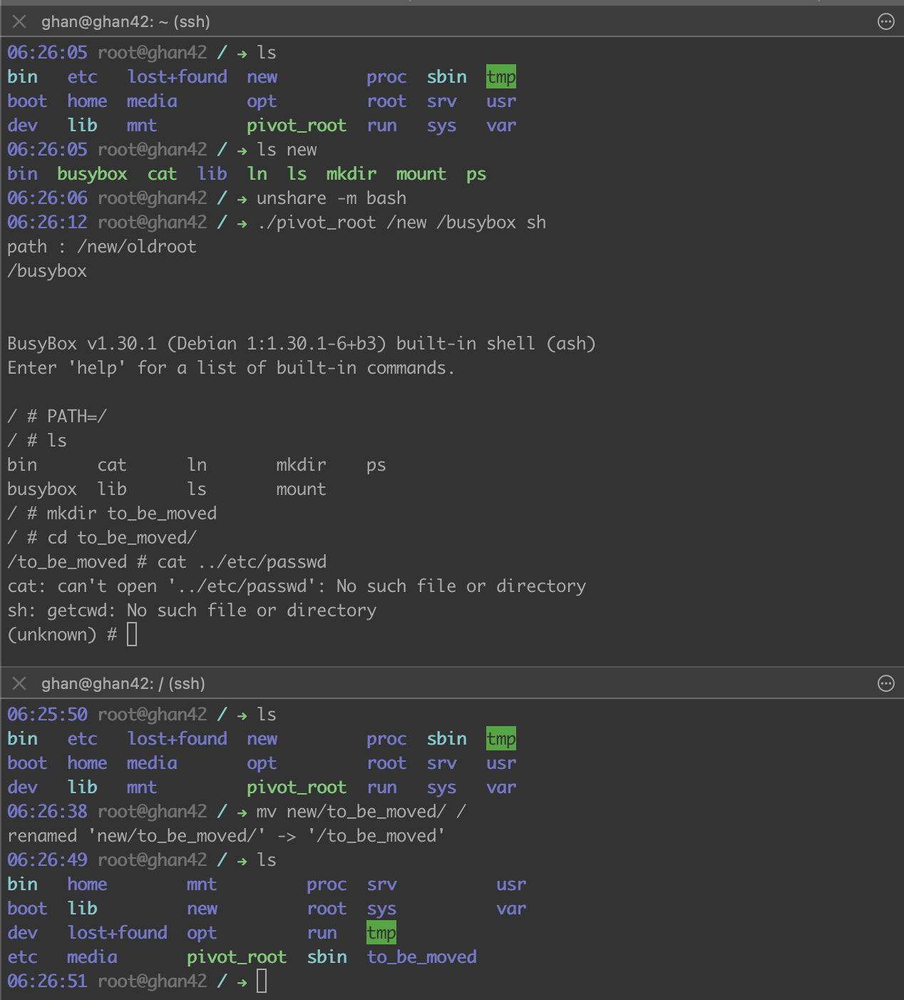
  </p>
  </figure>

  - Another usage of `pivot_root` other than isolating containers is during system startup, when the system switches initially mounted temporary root filesystem to the real root filesystem.

## Container Engine

- Contanerization, isolation of a group of processes, can be achieved via applying the concepts and utilizing Linux kernel APIs explained above.
- There are software products, so called "Container Engines" such as Docker, CRI-O, Railcar, RKT, LXC, and etc., which provide ways in which users can create and run containers easily via CLI.
- Most of these engines follow the standard set by the [Open Container Initiative](https://opencontainers.org/), a project backed by the Linux Foundation, which aims at "creating open industry standards around container formats and runtimes. Currently, the OCI governs standards for:
  - Container Image - [image format specification](https://github.com/opencontainers/image-spec).
  - Container Runtime - [container runtime specification](https://github.com/opencontainers/runtime-spec/blob/master/README.md) & [reference runtime implementation, `runc`](https://github.com/opencontainers/runc).
- Containers can be in two different states:
  - at rest - a container is a set of files. (container image)
  - running - a container is a group of processes. (running container)
- The engine's role is to unpack container image, pass metadata and files to the Linux kernel to create an isolated group of running processes, a container, as per the configuration on the images. In more details, the container engine is responsible for:
  - Handling user input (e.g. `docker [command]`)
  - Handling input via APIs from a "Container Orchestrator" such as Kubernetes
  - Pulling the container images from the registry server
  - Expanding the container image on disk using a graph driver (e.g. overlay2, devicemapper)
  - Preparing a container mount point
  - Prepare the metadata and call the container runtime to start the container.

### Container Image

- A container image is a file that is used as a mount point when starting containers.
- Images may be created locally. Or with help of a container engine, images may be pulled down from a registry server (a file server that stores container repositories, e.g. docker.io).
- LXD uses a single container image, while docker and RKT use multi-layered OCI-based images.
- A container repository is a directory which contains multiple container image layers and metadata about the layers.
- Image layers are connected in a parent-child relationship. Each image layer represents diff between itself and the parent layer. Each directive in a Dockerfile creates a new layer.
- In the example below, multiple layers per directive on the Dockerfile are created, a container based on a parent image can be created, and the images are in parent-child relationships.

<figure>
<p align="center">
  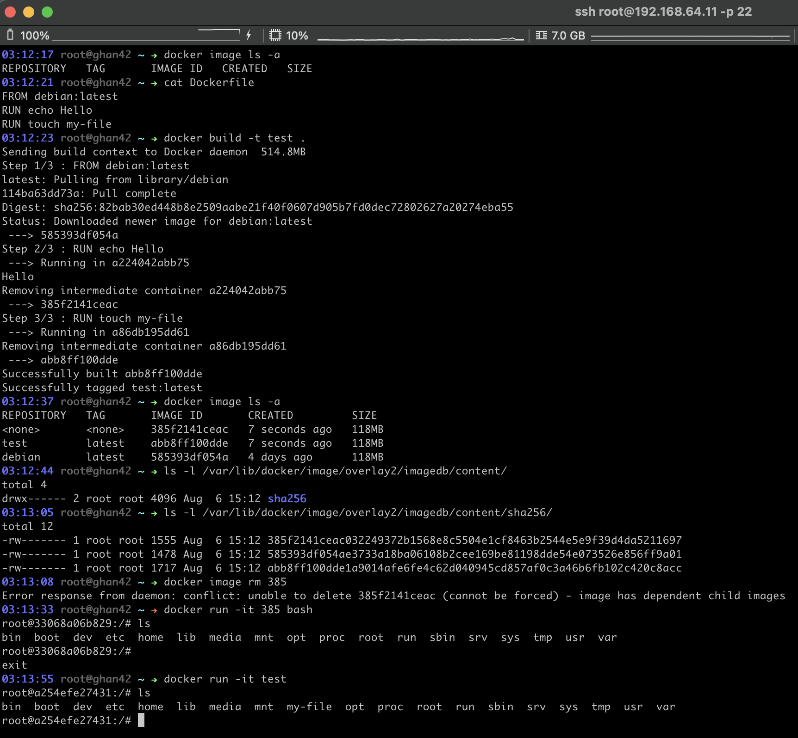
</p>
</figure>

### Container Runtime

- A container runtime prepares the isolated environments for a container by:

  - consuming the mount point and metadata provided by the container engine,
  - setting up cgroups, SELinux Policy & AppArmor rules,
  - `clone` system call to start containerized processes.

- So, the container runtime is essentially the parent process of the first process inside a container.
- Container engines use a container runtime as a component. The OCI runtime standard reference implementation, [`runc`](https://github.com/opencontainers/runc), is most widely used. Docker relies on `runc`. There are other implementations such as [`crun`](https://github.com/giuseppe/crun), [`railcar`](https://github.com/oracle/railcar), and [`katacontainers`](https://katacontainers.io/).
  - Docker initially relied on `LXC`. Later on, they developed their own library called libcontainer in Golang. After the OCI was created, Docker donated the libcontainer and it was grown up into `runc`.
- In the example below, during the containerization process, `runc` is executed.

<figure>
<p align="center">
  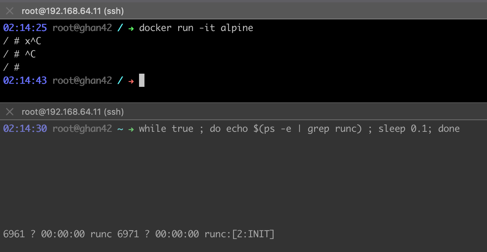
</p>
</figure>

- As shown in the next example, `runc` can be used directly by the user as a standalone process to run a container. `runc` requires a mountpoint and meta-data (config.json).

<figure>
<p align="center">
  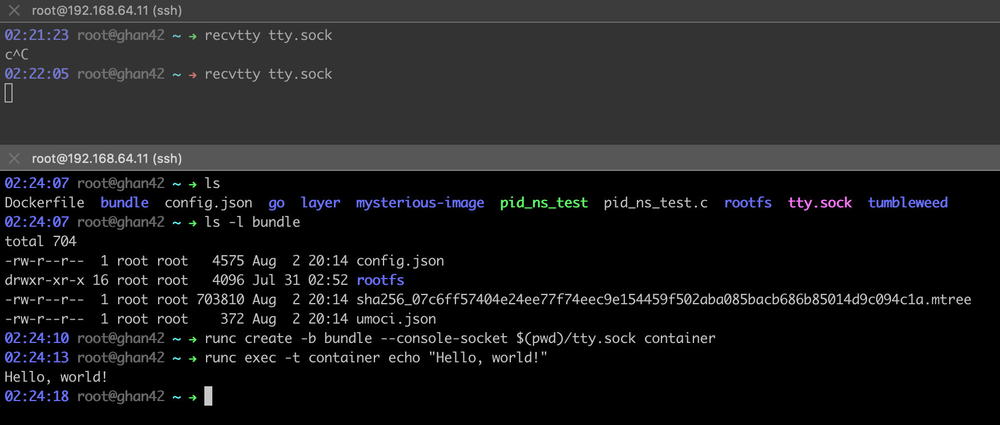
</p>
</figure>

# Docker

## Docker Engine Structure

# References

## Virtual Machine Network
- [VirtualBox networking modes](https://www.virtualbox.org/manual/ch06.html#networkingmodes)

## Debian & Alpine Linux

- [Debian changing language](https://wiki.debian.org/ChangeLanguage)
- [Debian locale setting](https://wiki.debian.org/Locale)
- [Linux man pages online](https://man7.org/linux/man-pages/index.html)
- [Janetakis, N. (2018). Benchmarking Debian vs Alpine as a Base Docker Image. [online]](https://nickjanetakis.com/blog/benchmarking-debian-vs-alpine-as-a-base-docker-image)
- [Janetakis, N. (2017). The 3 Biggest Wins When Using Alpine as a Base Docker Image. [online]](https://nickjanetakis.com/blog/the-3-biggest-wins-when-using-alpine-as-a-base-docker-image)
- [crunchtools.com. (n.d.). A Comparison of Linux Container Images. [online]](https://crunchtools.com/comparison-linux-container-images/)
- [www.redhat.com. (n.d.). Container Tidbits: Can Good Supply Chain Hygiene Mitigate Base Image Sizes? [online]](https://www.redhat.com/en/blog/container-tidbits-can-good-supply-chain-hygiene-mitigate-base-image-sizes)
- [opensource.com. (n.d.). Do Linux distributions still matter with containers? | Opensource.com. [online]](https://opensource.com/article/19/2/linux-distributions-still-matter-containers)
- [wiki.alpinelinux.org. (n.d.). Comparison with other distros - Alpine Linux. [online]](https://wiki.alpinelinux.org/wiki/Comparison_with_other_distros)

## Docker & Containers

- [Grunert, S. (2019). Demystifying Containers - Part I: Kernel Space. [online] Medium.](https://medium.com/@saschagrunert/demystifying-containers-part-i-kernel-space-2c53d6979504)
- [Grunert, S. (2019). Demystifying Containers - Part II: Container Runtimes. [online] Medium.](https://medium.com/@saschagrunert/demystifying-containers-part-ii-container-runtimes-e363aa378f25)
- [Grunert, S. (2019). Demystifying Containers — Part III: Container Images. [online] Medium.](https://medium.com/@saschagrunert/demystifying-containers-part-iii-container-images-244865de6fef)
- [Red Hat Developer. (2018). A Practical Introduction to Container Terminology. [online]](https://developers.redhat.com/blog/2018/02/22/container-terminology-practical-introduction)
- [crosbymichael (2016). dockercon-2016/Creating Containerd.pdf at master · crosbymichael/dockercon-2016. [online] GitHub.](https://github.com/crosbymichael/dockercon-2016/blob/master/Creating%20Containerd.pdf)
- [Stack Overflow. (n.d.). docker - How containerd compares to runc. [online]](https://stackoverflow.com/questions/41645665/how-containerd-compares-to-runc)
