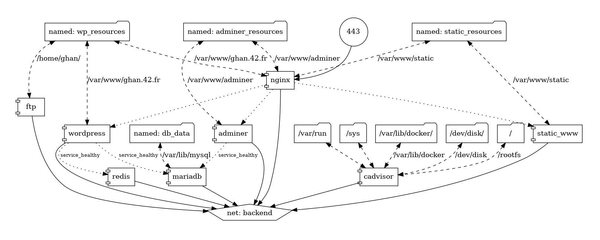

# Inception

System administration by using Docker containers

---

# Background Information

## Virtual Machine

- Read [a section on VM network](docs/VMNETWORK.md).

## Linux on Containers

- Read [a section on Linux on containers](docs/LINUX.md).

## Container Basics

- Read [a section on container basics](docs/CONTAINER.md).

## Docker

- Refer to [a section on Docker](https://docs.docker.com/get-started/overview/).

## TLS

- Read [a section on TLS](docs/TLS.md).

---

# Services

## Overview

## MariaDB

- Read [a section on MariaDB](docs/services/MARIADB.md).

## NGINX

- Read [a section on NGINX](docs/services/NGINX.md).

## Wordpress

- Read [a section on WordPress](docs/services/WP.md).

## Redis

- Read [a section on Redis](docs/services/REDIS.md).

## FTP

- Read [a section on FTP](docs/services/FTP.md).

## Adminer

- Read [a section on Adminer](docs/services/ADMINER.md).

## cAdvisor

- Read [a section on cAdvisor](docs/services/cAdvisor.md).

## Static Webpage

- Read [a section on Static Webpage](docs/services/STATIC_WWW.md).
