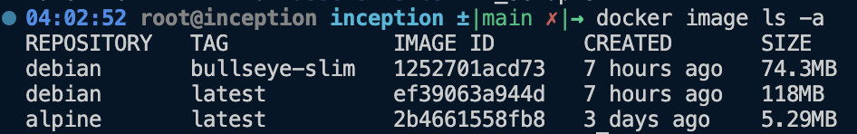

# Linux on Containers (Debian & Alpine)
## Setting up Host Linux System to Run Containers
- Execute [the setup script](./vm_setup.sh).

- How to support secondary language (Korean)

  - Execute the following command, and choose the preferred language

  ```
  dpkg-reconfigure locales
  ```

  - `export LANG=ko_KR.UTF_8`
  - Install the language's font. (Install `nanum` font)

  ```
  apt-get install fonts-nanum fonts-nanum-coding fonts-nanum-extra
  ```

  - reboot

- [How to install Docker Engine on a linux machine](https://docs.docker.com/engine/install/ubuntu/) (follow the instruction on the link)

## Base Image vs. Distroless
- Container images can be built either by using a base image of a Linux distribution, or building from scratch (called distroless container images).
- Even though the distroless images take much less storage space and provide access to the latest packages, freedom to customize comes with responsiblity. The developer will need to update libraries, fix security vulnerabilities on his own. Updating dependencies and libraries may lead to frequent incompatibility issues in code which  ultimately may countervail improvement in efficiency achieved by small storage space.
- On the other hand, by using a base image, developers can save their time and focus on an application running in a container by relying on efforts of Linux maintainers. Downside is that the final image becomes larger due to all sorts of dependencies, compared to distroless images.

## Choosing the Best Base Image
- Each Linux distribution has a different set of Pros and Cons. Alpine offers the smallest size, but uses less popular libc, muslc. RedHat stream OSs offer the best security and support, but is relatively large in size. These differences are explained in details in [this article](https://crunchtools.com/comparison-linux-container-images/).
- Although it is important, bare size cannot be the only measure for choosing the base image. Some argue that having less dependencies, in case of Alpine Linux, expose less attack surface, and therefore offers better security. The others, the RedHat stream, argue that assessment must be made [on the whole eco-system scale](https://www.redhat.com/en/blog/container-tidbits-can-good-supply-chain-hygiene-mitigate-base-image-sizes), and disadvantages in size can be mitigated by build caches.

## Alpine Linux
- For this project, Alpine and Debian are given as options, and Alpine was chosen for following reasons:
  - Alpine is much lighter than Debian (busybox instead of GNU Core Utils, musl libc instead of glibc). Size matters when images are distributed to rated cloud services (Nick shows price comparison in his [article](https://nickjanetakis.com/blog/the-3-biggest-wins-when-using-alpine-as-a-base-docker-image)).
    <figure>
      <p align="center">
        
      </p>
    </figure>
  - Alpine's package manager `apk` automatically cleans up packages while debian requires an additional command (`apt-get clean`) to be executed.
  - Alpine exposes less attack surface.
  - Alpine is more intriguing.

### Setting the Timezone in Alpine
```bash
  apk update \
	&& apk add --no-cache --virtual build-deps tzdata \
	&& cp /usr/share/zoneinfo/Asia/Seoul /etc/localtime \
	&& echo "Asia/Seoul" > /etc/timezone \
	&& apk del build-deps

  # "Asia/Seoul" can be replaced by any desired timezone that exists in /usr/share/zoneinfo
```

## References
- [Debian changing language](https://wiki.debian.org/ChangeLanguage)
- [Debian locale setting](https://wiki.debian.org/Locale)
- [Linux man pages online](https://man7.org/linux/man-pages/index.html)
- [Alpine Package Keeper Wiki](https://wiki.alpinelinux.org/wiki/Alpine_Package_Keeper)
- [Janetakis, N. (2018). Benchmarking Debian vs Alpine as a Base Docker Image. [online]](https://nickjanetakis.com/blog/benchmarking-debian-vs-alpine-as-a-base-docker-image)
- [Janetakis, N. (2017). The 3 Biggest Wins When Using Alpine as a Base Docker Image. [online]](https://nickjanetakis.com/blog/the-3-biggest-wins-when-using-alpine-as-a-base-docker-image)
- [crunchtools.com. (n.d.). A Comparison of Linux Container Images. [online]](https://crunchtools.com/comparison-linux-container-images/)
- [www.redhat.com. (n.d.). Container Tidbits: Can Good Supply Chain Hygiene Mitigate Base Image Sizes? [online]](https://www.redhat.com/en/blog/container-tidbits-can-good-supply-chain-hygiene-mitigate-base-image-sizes)
- [opensource.com. (n.d.). Do Linux distributions still matter with containers? | Opensource.com. [online]](https://opensource.com/article/19/2/linux-distributions-still-matter-containers)
- [wiki.alpinelinux.org. (n.d.). Comparison with other distros - Alpine Linux. [online]]op(https://wiki.alpinelinux.org/wiki/Comparison_with_other_distros)
- [wiki.alpinelinux.org. (n.d.). Setting the timezone - Alpine Linux. [online]](https://wiki.alpinelinux.org/wiki/Setting_the_timezone)