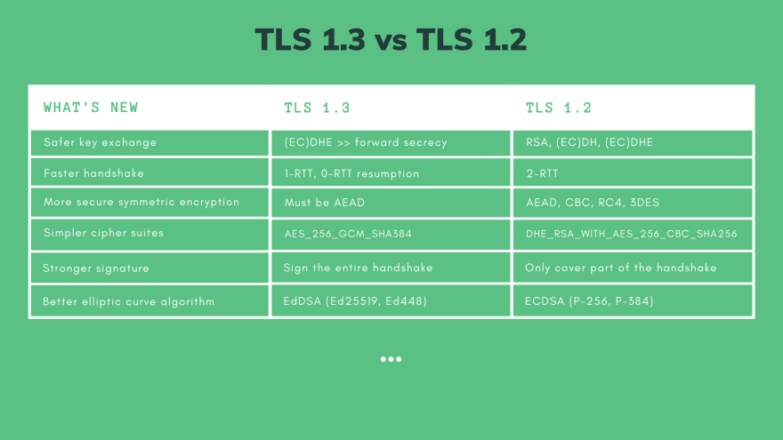

# TLS

## Introduction
- TLS stands for Transport Layer Security. It was conceived as SSL(Secure Socket Layer) in 1995 and later changed its name to TLS as it was developed.
- TLS provides these aspects of security in data transport process:
  - **Authentication** - ensures the parties exchanging data are who they claim to be.
  - **Confidentiality** - the data is encrypted, so third parties cannot understand the data.
  - **Integrity** - verifies that the data is not corrupted.

## Procedure
- Handshake protocol (Authentication)
  - Authentication purpose.
  - Establish a secret key for symmetric encryption.
- Record protocol (Confidentiality & Integrity)
  - Encrypting & decrypting messages.
  - Transportation of encrypted data.

## Symmetric Cryptography
- Relatively faster.
- Although, a hacker may intercept the message, but will not be able to understand it since it is decrypted.
- Dangerous if the shared private key is leaked.
- Although the hacker cannot understand the message, the hacker may change bits, and thus make the data stale.
- To solve the problem above, authenticated encryption is used.
  - Before transfer of data, the encrypted message, a nonce, and the shared secret key are passed to MAC algorithm (GMAC, POLY1305, etc.).
  - As the result, a MAC (Message Authentication Code) is generated and tagged to the encrypted message.
  - Now the encypted message with MAC tag is transferred to the recipient.
  - In TLS 1.3, along with the three inputs, associated data such as addresses, ports, protocol version and a sequence number are provided to Mac algorithm. This process is called AEAD(Authenticated Encryption with Associated Data).
  - By these additional information, the recipient can authenticate the message by processing the encrypted message with MAC in reverse way. Note that the same nonce (usually included in the encrypted message), the shared secret key and the associated data are provided to MAC algorithm with the encrypted message.
  - The recipient can then compare the generated MAC with the tagged MAC. If they are the same, the recipient can verify that the message has not been corrupted.
- There still is a danger of leaking the shared secret key.

## Asymmetric Cryptography
- Relatively slower.
- Asymmetric cryptography is used for:
  - key exchange,
  - encryption system,
  - digital signature.
### Diffie-Hellman
- A public base, `g`, a public modulus, `p`, a private key of the sender, `a`, a private key of the recipient, `b`.
- The sender computes his own public key: A(sender's public key) = `g^a % p`.
- The recipient computes his own public key: B(recipient's public key) = `g^b % p`.
- They exchange the public keys.
- Magically, `S (secret key) = B^a % p = A^b % p`, since `g^(ba) % p = g^(ab) % p`!!
- Note that each encryption algorithm requires a shared secret key of different lengths. Therefore, in order to aquire the same secret key, both the sender and the recipient must use the same HKDF (key derivation function based on HMAC(Hashed-based Message Authentication Code)) that generates the shared secret key of a required length.
- `p`, `g`, `A` and `B` are known to the public, but if `p`, `g`, `a` and `b` are chosen carefully (`p`: 2048-bit prime number; `a` & `b`: 256-bit random intgers; `g`: primitive root modulo `p`), the functions `A or B = g^(a or b) % p` form a trapdoor function (easy to compute in one way - computing `A` -, but extremely hard in reverse way - computing `a`).
- This mathmatical method of securing cryptographic key exchange is named after Whitfield Diffie and Martin Hellman, and thus called, "Diffie-Hellman key exchange".
- There still is a danger. If the sender and the recipient each use the same `a` and `b`, a hacker can record these and will get closer to the right key as time goes by.
- To solve this issue, ephemeral and different keys are used for each session.

### Elliptic-Curve Cryptography
- Use a different tranpdoor function that is based on the algebraic structure of elliptic curves.
- It requires smaller keys to provide equivalent security.

### Key Derivation Function
- KDF(Key Derivation Function) receives IKM(Input Key Material - the secret key, S), a key length, a hash function(such as HMAC-SHA256), and optional info and salt as inputs and outputs a secret key of required length.

## Assymetric Encryption
- The sender encrypts the message with the recipient's public key, and the recipient decrypts the message with his private key. The public and private keys are connected by a trapdoor function.
- The public key and the private key come in pair, and only the private key can decrypt. Even though a hacker may acquire the public key, the hacker will not be able to decrypt it.
- Since anybody in the public network has access to the public key, a hacker in the middle may replace the public key with his own, and if the sender encrypts the message with the hacker's public key, the hacker will be able to decrypt the message with his private key.

## Digital Certificate
- In order to solve the security issue explained at the end of the last section, when the recipient sends out his public key to the sender, he sends a digital certificate, verified and signed by a CA (Certificate Authority), that contains the public key.
- Certificate signing is done in following procedure:
  - A user creates a CSR(Certificate Signing Request).
  - The user signs the CSR with his private key and sends the CSR to the CA.
  - The CA verifies identity and the user's signature with the user's public key.
  - If everything is valid, the CA signs the certificate with their private key and sends it to the user.
- Now the recipient sends his signed certificate to the sender and the sender verifies the certificate with a CA(among many CAs the sender knows, the one that has the public key that matches the private key that signed the certificate)'s public key.
- The hacker can no longer fake the certificate.
- There is a chain of trust. A certificate is signed by a higher level CA, the higher level's certificate is signed by even higher...

## TLS 1.3 Full Handshake Examples
- Client Hello
  - supported versions: TLS 1.3, TLS 1.2
  - supported cipher suites: TLS_AES_256_GCM_SHA384, TLS_CHACHA20_POLY1305_SHA256
  - suppored key exchange groups: Finite Field Groups(DHE), Elliptic Curve Groups(ECDHE)
  - key share: Client's DHE public key, Client's ECDHE public key 
  - supported signature algorithm: RSA-PSS, ECDSA
- Server Hello
  - selected versions: TLS 1.3
  - selected cipher suites: TLS_AES_256_GCM_SHA384
  - selected key exchange groups: Finite Field Groups (DHE)
  - key share: Server's DHE public key
  - certificate request: Request for client's certificate
  - server certificate: Server's cetificate
  - certificate verify: Signature of entire handshake
  - server finish: MAC of entire handshake
- Client Finish (if everything is good so far)
  - client certificate: Client's certificate
  - certificate verify: signature of entire handshake
  - client finish: MAC of entire handshake

## Pre-shared Key & Zero Round-Trip Time (0-RTT)
- After initial handshake, the server sends multiple session tickets the client can use to skip the full handshake.
- By using the pre-shared key, the client can skip handshake and sends application data as it sends out the pre-shared key (0-RTT).
- 0-RTT reduces latency, but a hacker may replay the 0-RTT to attack the server.

## TLS 1.3 vs TLS 1.2
<figure>
  

    
  

  <figcaption align="center" style="font-weight: bold;">TLS 1.3 vs TLS 1.2 from <a href="https://dev.to/techschoolguru/a-complete-overview-of-ssl-tls-and-its-cryptographic-system-36pd">DEV Community. (n.d.). A complete overview of SSL/TLS and its cryptographic system. [online]</a></figcaption>
</figure>

## References
- [DEV Community. (n.d.). A complete overview of SSL/TLS and its cryptographic system. [online]](https://dev.to/techschoolguru/a-complete-overview-of-ssl-tls-and-its-cryptographic-system-36pd)
- [DEV Community. (n.d.). How to create & sign SSL/TLS certificates. [online]](https://dev.to/techschoolguru/how-to-create-sign-ssl-tls-certificates-2aai)
- [Cloudflare (2021). What Is Transport Layer Security? | TLS Protocol | Cloudflare. Cloudflare. [online]](https://www.cloudflare.com/learning/ssl/transport-layer-security-tls/)
- [High Performance Browser Networking. (n.d.). Networking 101: Transport Layer Security (TLS) - High Performance Browser Networking (O’Reilly). [online]](https://hpbn.co/transport-layer-security-tls/)