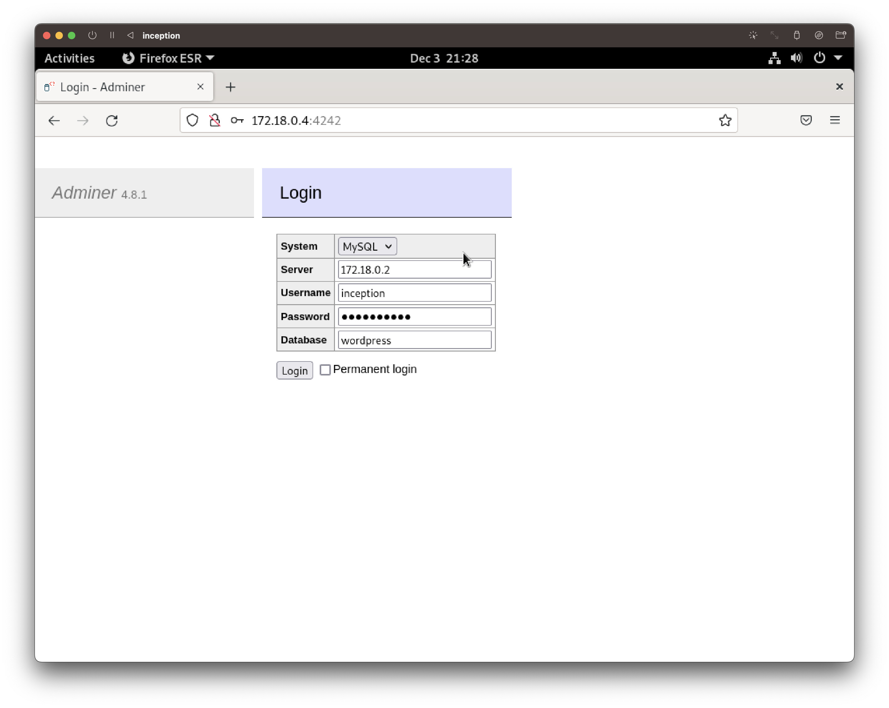
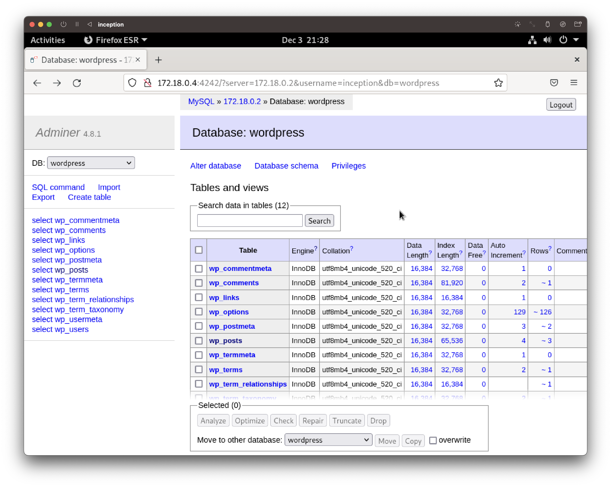

# Adminer
## Introduction
- Adminer is a GUI database management tool, written in PHP, which can be accessed via web browsers.
- It is an open source project, written by Jakub Vrána.
- Whereas [phpMyAdmin](https://www.phpmyadmin.net/) supports MySQL only, Adminer supports various other SQL databases such as PostgreSQL and SQLite.
- Differences between phpMyAdmin and Adminer can be found in [this link](https://www.adminer.org/en/phpmyadmin/).

## Quick Links
  - [Dockerfile for Adminer Image](../../srcs/services/adminer/Dockerfile)
  - [Mariadb Container's Entrypoint Shell Script](../../srcs/services/adminer/adminer_entrypoint.sh)
  - [Docker Compose for Inception](../../srcs/docker-compose.yml)

## Downloading the Script
- Adminer is a single PHP script. It can be downloaded from the official website. Following command is executed in the entrypoint shell script of the Adminer container to download the script.
  ```bash
  curl -LO https://github.com/vrana/adminer/releases/download/v4.8.1/adminer-4.8.1-mysql-en.php
  ```

## Setting Up
- Then, the script is moved to a path where a NGINX server will recoginize as the root directory, and renamed as `index.php`.
  ```bash
  mv adminer-4.8.1-mysql-en.php /var/www/adminer/index.php
  ```
- In this project, the directory, `/var/www/adminer` is mounted as a volume, and shared with NGINX container, in order to enable the NGINX server to host Adminer.
  ```yaml
  # docker-compose.yml
  # nginx container volumes configuration
  volumes:
    - wp_resources:/var/www/ghan.42.fr
    - adminer_resources:/var/www/adminer
    - static_resources:/var/www/static

  # adminer container volumes configuration
  volumes:
    - adminer_resources:/var/www/adminer
  ```
- `php-fpm` needs to be installed, configured and run to execute the Adminer script as requested by the NGINX server according to the CGI protocol. Refer to [this section](WP.md#php-fpm) for more details on `php-fpm`.
- The NGINX server is configured as below. Requests to the host `172.18.0.4(NGINX container's IP):4242` will be passed to the `php-fpm` process that is listening from `172.18.0.5(Adminer container's IP):9000`, and thus execute Adminer (`index.php`).
  ```shell
  server {
    listen   4242; # Listen to the port 4242
    server_name  adminer;
    
    access_log  /var/log/nginx/adminer.log  main;

    root /var/www/adminer;
    index index.php;

    location = /favicon.ico {
        log_not_found off;
        access_log off;
    }

    location / {
        try_files $uri $uri/ /index.php?$args;
    }

    location ~ \.php$ {
        include /etc/nginx/fastcgi.conf;
        fastcgi_intercept_errors on;
        fastcgi_pass 172.18.0.5:9000; 
    }
  }
  ```

## Using Adminer
- After setting up, go to the `ip:port` of the NGINX server that is hosting Adminer in the browser. Following login page will pop up. Fill out the blank boxes and click the 'login' button. Note that in the 'Server' box, the IP address of the host that is running the database must be written.
  <figure>
      <p align="center">
        
      </p>
  </figure>

  - The user from the Adminer container's host must have been granted privileges to access the databse. This has been done in the build process of the Mariadb container.
	```
	mariadb -u root -e "CREATE USER IF NOT EXISTS '$DB_USER'@'$ADMINER_REMOTE_ADDRESS';" \
	&& mariadb -u root -e "GRANT ALL PRIVILEGES ON *.* TO '$DB_USER'@'$ADMINER_REMOTE_ADDRESS' IDENTIFIED BY '$DB_PASSWD';"
	```
- Once logged in, the user will be able to access and edit databases according to the privileges granted by the database server.
  <figure>
      <p align="center">
        
      </p>
  </figure>

## Reference
- [www.adminer.org. (n.d.). Adminer - Why is better than phpMyAdmin? [online]](https://www.adminer.org/en/phpmyadmin/)