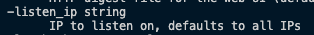
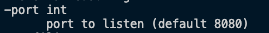
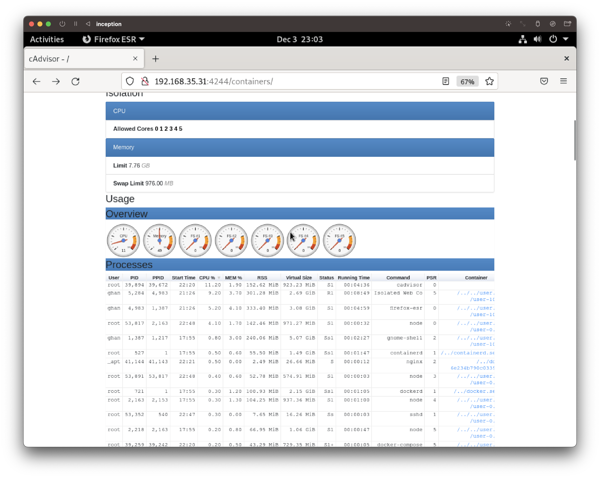

# cAdvisor

## Introduction
- [cAdvisor](https://github.com/google/cadvisor)(Container Advisor) is a monitoring tool that provides information on resource usage and performance aspects of containers to container users.
- cAdvisor collects, organizes and exports information about running containers. By default, itt serves the information to requests passed to the port `8080` according to HTTP via any network interface (by defaults it listens to all IPs).
  - Whether to which IP address and port cAdvisor will bind can be configured by using following options.
    <figure>
      <p align="center">
        
      </p>
    </figure>
    
    <figure>
        <p align="center">
          
        </p>
    </figure>
- It offers options of exporting the information to thrid-party apps such as Redis, ElasticSearch, Kafka, etc. by using `-storage_driver*` options.
	
## Quick Links
- [Dockerfile for cAdvisor Image](../../srcs/services/cadvisor/Dockerfile)
- [cAdvisor Container's Entrypoint Shell Script](../../srcs/services/cadvisor/cadvisor_entrypoint.sh)
- [Docker Compose for Inception](../../srcs/docker-compose.yml)

## Installation
- A cAdvisor binary executable can be downloaded from [this github repository](https://github.com/google/cadvisor/releases/tag/v0.46.0).
  ```shell
  wget https://github.com/google/cadvisor/releases/download/v0.46.0/cadvisor-v0.46.0-linux-$TARGETARCH
  chmod +x cadvisor-v0.46.0-linux-$TARGETARCH
	mv cadvisor-v0.46.0-linux-$TARGETARCH /usr/local/bin/cadvisor
  ```

## Run
- cAdvisor can be run from a docker container from its official image.
  ```shell
  docker run \
  --volume=/:/rootfs:ro \
  --volume=/var/run:/var/run:ro \
  --volume=/sys:/sys:ro \
  --volume=/var/lib/docker/:/var/lib/docker:ro \
  --volume=/dev/disk/:/dev/disk:ro \
  --volume=$GOPATH/src/github.com/google/cadvisor/perf/testing:/etc/configs/perf \
  --publish=8080:8080 \
  --device=/dev/kmsg \
  --security-opt seccomp=default.json \
  --name=cadvisor \
  gcr.io/cadvisor/cadvisor:<tag> -perf_events_config=/etc/configs/perf/perf.json
  ```
  > Look at all the bind mounting and device mapping in order to allow the cAdvisor in a container to monitor its host machine's data.
- Running cAdvisor as a standalone service only requires running `cadvisor` command with [options](https://github.com/google/cadvisor/blob/master/docs/runtime_options.md) if wanted.
  - However, in order to run the service inside a custom built docker container, all the bind mounting, device mapping and bestowing `privileged` status to the container is required. These requirements are configured in `docker-compose.yml`.
    ```yaml
    cadvisor:
      privileged: true
      build:
        context: ./services/cadvisor
      container_name: cadvisor
      expose:
        - "8080"
      hostname: inception_cadvisor
      networks:
        backend:
          ipv4_address: 172.18.0.7
      volumes:
        - /:/rootfs:ro \
        - /var/run:/var/run:ro \
        - /sys:/sys:ro \
        - /var/lib/docker/:/var/lib/docker:ro \
        - /dev/disk/:/dev/disk:ro \
      devices:
        - "/dev/kmsg:/dev/kmsg"
      restart: on-failure
    ```

## Hosting
- A NGINX server has been configured as a proxy server as below, such that the monitoring page may be accessed by remote users via web.
  ```
  server {
    listen   4244;
    server_name  static;
    
    access_log  /var/log/nginx/cadvisor.log  main;

    location / {
        proxy_pass  http://172.18.0.7:8080;
    }
  }
  ```
- As the result, system usage information by containers can be accessed via web through the port, `4244`.
  <figure>
    <p align="center">
      
    </p>
  </figure>

## References
- [GitHub. (2021). google/cadvisor. [online]‌](https://github.com/google/cadvisor)
- [MetricFire (n.d.). Monitoring Docker Containers with cAdvisor | MetricFire Blog. [online]](https://www.metricfire.com/blog/monitoring-docker-containers-with-cadvisor/)