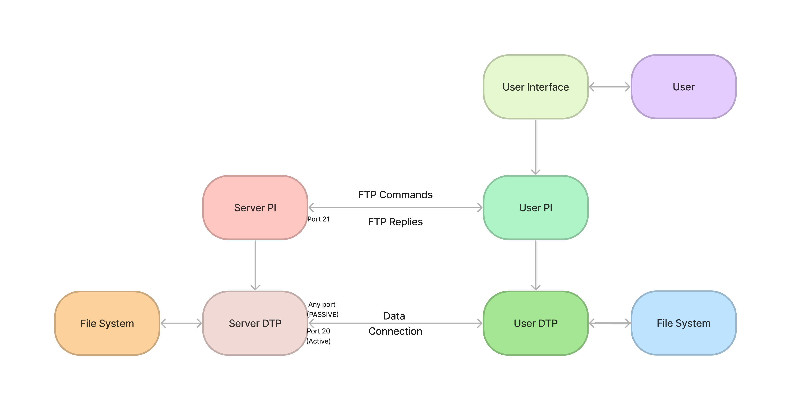
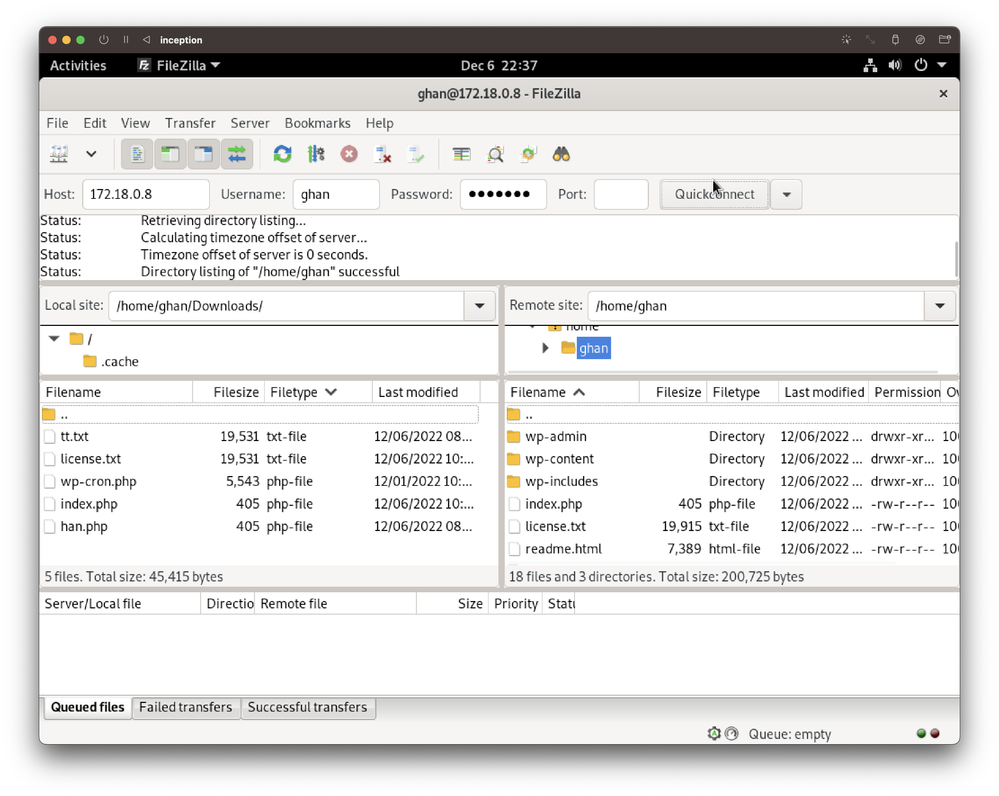

# FTP

## Quick Links
- [vsftpd Configuration for Inception - /etc/vsftpd/vsftpd.conf](../../srcs/servics/ftp/configs/vsftpd.conf)
- [Dockerfile for FTP Image](../../srcs/services/ftp/Dockerfile)
- [FTP Container's Entrypoint Shell Script](../../srcs/services/ftp/ftp_entrypoint.sh)
- [Docker Compose for Inception](../../srcs/docker-compose.yml)

## Introduction
- FTP stands for File Transfer Protocol. The official specification of the protocol is documented in [RFC 959](https://www.rfc-editor.org/rfc/rfc959).
- The protocol enables reliable and efficient sharing of files between remote hosts over TCP/IP connection.
- FTP model can be illustrated as a diagram below. Detailed explanation on this model can be found in the section 2.3 of [RFC 959](https://www.rfc-editor.org/rfc/rfc959).
  <figure>
    <p align="center">
      
    </p>
  </figure>

  > The left half is server-side and the right half is client-side. `PI` stands for Protocol Interpreter, `DTP` stands for Data Transfer Program.
  - At first, the client requests for connection establishment via the port 21 of the server's host. This connection is called a control connection. Via the connection, FTP commands are passed from the client to the server and FTP replies are transported from the server to the client. The control connection remains established during the entire FTP session.
  - As data transfer requests hit the server, a data connection is established between the server DTP and the client DTP. Actual data is transferred via this connection.
    > Refer to this link to check differences between "active" mode and "passive" mode.
- Data and password are transferred in clear texts, so it is highly recommended to use some sort of encryption.

## Installation of FTP Server
- A FTP server that can be installed and used in Alpine Linux is `vsftpd`. It can be installed by `apk`.
  ```shell
  apk update && apk add vsftpd
  ```

## Configuration
- After installing `vsftpd`, a configuration file is created at `/etc/vsftpd/vsftpd`.
- Access from remote hosts are enabled by turning on the `listen` option. If the option is on, the server listens on IPv4 sockets (`*:21` - 21 is the reserved port number for FTP control connections).
  ```shell
  # /etc/vsftpd/vsftpd.conf

  listen=YES
  ```
- If the option `anonymous_enable` is on, a client can establish with no user info and the server points to `/var/lib/ftp`.
  ```shell
  # /etc/vsftpd/vsftpd.conf

  anonymous_enable=YES
  ```
- In this project, for security reasons, following options were set, such that local users of the server's host may connect to the server from the remote after providing the users' passphrases.
  ```shell
  # /etc/vsftpd/vsftpd.conf

  local_enable=YES
  no_anon_password=YES
  ```
  - By default, when the local user connects to the server, the server points to the user's home directory.
- By default, the server only allows read actions. In order to enable FTP wrie commands, such as file uploads in perspective of FTP clients, `write_enable` option must be set to "YES".
  - It is important to give appropriate permission on the resources the server is pointing to in order to enable write actions.

## Running the FTP Server
- `vsftpd` can be run in the following way. By passing the path of a configuration file, the configuration can be applied to the server's instance.
  ```shell
  vsftpd /etc/vsftpd/vsftpd.conf
  ```

## Interacting with FTP Server by Filezilla
- In this project, an instance of FTP server is set to point to the volume of the Wordpress website.
  ```yaml
  # docker-compose.yml
  # ftp service
  # client will be able to access the volume when logged in as 'ghan'

  volumes:
    - wp_resources:/home/ghan
  ```
- A user can connect to FTP server via cli, but FTP is designed to be used by programs. In this project, [Filezilla](https://filezilla-project.org/) is chosen to show demonstration.
  <figure>
    <p align="center">
      
    </p>
  </figure>

## References
- [Postel, J. and Reynolds, J. (1985). File Transfer Protocol. doi:10.17487/rfc0959.](https://www.rfc-editor.org/rfc/rfc959)
- [www.javatpoint.com. (n.d.). FTP - File Transfer Protocol - javatpoint. [online]](https://www.javatpoint.com/computer-network-ftp)
- [Appspot.com. (2015). vsftpd - Secure, fast FTP server for UNIX-like systems. [online]](https://security.appspot.com/vsftpd.html)
- [wiki.alpinelinux.org. (n.d.). FTP - Alpine Linux. [online]](https://wiki.alpinelinux.org/wiki/FTP)
- [Filezilla-project.org. (2019). FileZilla - The free FTP solution. [online]](https://filezilla-project.org/)
- [WPBeginner. (2017). How to Use FTP to Upload Files to WordPress for Beginners. [online]](https://www.wpbeginner.com/beginners-guide/how-to-use-ftp-to-upload-files-to-wordpress-for-beginners/)