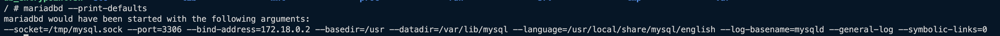
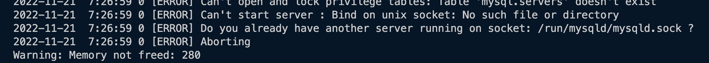
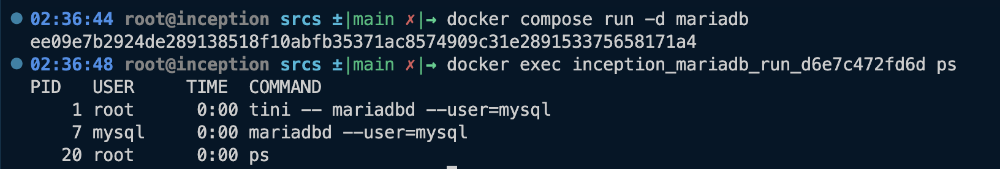
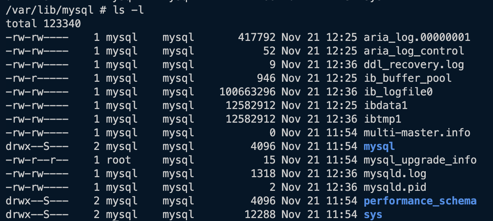
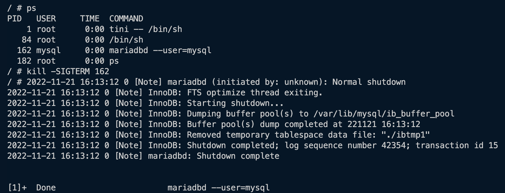
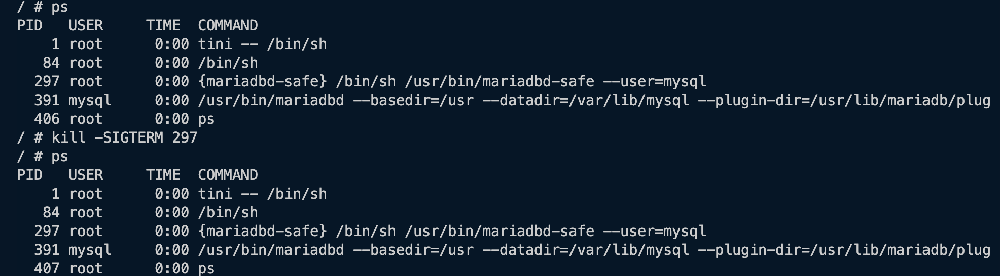

# MariaDB

## Quick Links
  - [MariaDB Configuration for Inception - /etc/my.cnf](../../srcs/services/mariadb/configs/my.cnf)
  - [Dockerfile for MariaDB Image](../../srcs/services/mariadb/Dockerfile)
  - [Mariadb Container's Entrypoint Shell Script](../../srcs/services/mariadb/db_entrypoint.sh)
  - [Docker Compose for Inception](../../srcs/docker-compose.yml)

## Introduction
- MariaDB is an open source relational database management system.
- "When MariaDB Server’s predecessor, MySQL, was bought by Oracle in 2009, MySQL founder Michael “Monty” Widenius forked the project due to concerns about Oracle’s stewardship, naming the new project MariaDB." from [MariaDB Foundation](https://mariadb.org/en/).

## Install MariaDB Packages (in Alpine Linux)
- Install mariadb server (to provide DB server service) and mariadb-client (to initialize system table and create a user) by using a package manager.
	```bash
		apk update \
		&& apk add --no-cache mysql= 10.6.10-r0 \
		mysql-client=10.6.10-r0
	```
	> Installing the mysql-* packages via `apk` will instead install MariaDB.
- As the result of installing these packages, a user named `mysql` will be created on the system and the user and the system's `root` will be added to a new group `mysql`, and two users, `root` and `mysql`, will be registered to the database.

## MariaDB Configuration
- Before installing the system table and running the server, a few options are required to be and can be configured.
- By default, these options are read from `/etc/my.cnf`, and then `~/my.cnf`. These paths may be changed by setting `--defaults-file` when running mariadb CLI tools. Also, inside the default files, other option files may be included by using `!include` or `!includedir` directives.
  > If the same option is set more than once, the last value is set.
- By passing `--print-defaults` option to mariadb CLI tools, the applied default options, that were set in the default files, are listed.
  <figure>
      <p align="center">
        
      </p>
  </figure>
- Following `my.cnf` was applied to this project. Meaning of some important options will be explained in the following sub-section.
  ```text
    # This group is read both both by the client and the server
    # use it for options that affect everything
    [client-server]
    socket=/tmp/mysql.sock
    port=3306

    # This group is read by the server
    [mysqld]
    bind-address=172.18.0.2

    # Directory where to find the mysqld binary from
    basedir=/usr

    # Directory where you want to put your data
    datadir=/var/lib/mysql

    # Enable logging by default to help find problems
    general-log

    # Disabling symbolic-links is recommended to prevent assorted security risks
    symbolic-links=0
  ```
### (Some) Mariadb Server System Variables
- `skip-networking`
  - **Commandline**: `--skip-networking`
  - A boolean value, and if set to 0, the server does not listen to TCP/IP connections.
- `socket`
  - **Commandline**: `--socket=name`
  - The name of the socket file used for local client connections. In Alpine Linux, the default value is set to `/run/mysqld/mysqld.sock`.
  - If the same error as the image below occurs, create the parent directory of the socket's path and set appropriate permissions.
    <figure>
      <p align="center">
        
      </p>
    </figure>
- `port`
  - **Commandline**: `--port=#, -P`
  - Port to listen for TCP/IP connections, also via which the client and the server will communicate.
- `bind-address`
  - **Commandline**: `--bind-address=addr`
  - By default, the server listens for all addresses, by specifying the address, bind the TCP/IP socket to listen for only a ceratin IP address/range of addresses.
- `basedir`
  - **Commandline**: `--basedir=path or -b path`
  - Path to the MariaDB installation directory.
- `datadir`
  - **Commandline**: `--datadir=path or -h path`
  - Directory where the data will be stored.
- For further details, refer to [the full list](https://mariadb.com/kb/en/server-system-variables/).


## Setting Up the System Table
- Run `mariadb-install-db --user=mysql` to initialize system table according to a configuration provided by `/etc/my.cnf`.
- As the result, in the path specified by `datadir` option in `/etc/my.cnf`, system tables are installed. In case of this project, `datadir` is set to `/var/lib/mysql`.
- Note that it is not recommended to run `mariadbd` (DB server) as the system's root user. By doing so, any user with the FILE privilege can create or modify resources on the server as root. That is why `--user` flag is set to `mysql` for both `mariadb-install-db` and `mariadbd`.
  <figure>
    <p align="center">
      
    </p>
  </figure> 
- As per the image below, the system table is owned by the user that ran `mariadb-install-db` script. If the user that runs `mariadbd` does not have permissions to this data, starting the server will fail.
  <figure>
      <p align="center">
        
      </p>
  </figure>
- If the system table is already there, running `mariadb-install-db` runs `mariadb-upgrade` instead, which is a tool that checks and updates tables to the latest version.

## Starting the Server
- Now the server must be ready to run! Run mariadb server by executing `mariadbd` with the `--user=mysql` option.
  - Executing `mariadbd` manually is a way to start the server daemon in the context of containerized environment, where there is no init system. However, if there is an init system such as `systemd` or `Open RC`, the server can be started by using the system dependent init system interface (e.g. `service mariadb start` in case of `systemd` based systems).
- When the server needs to be started manually, MariaDB recommends running `mariadbd-safe` instead of `mariadbd`. It is a wrapper that starts the database server with some extra safety features, such as automatically restarting the server when it crashes.
  - However, in this project, `mariadbd-safe` was not used for the script sets a signal handler to ignore `SIGTERM`. This causes a problem because `docker stop` terminates containers by sending `SIGTERM`. Once `mariadbd-safe` receives SIGTERM from the host, it will not pass the signal to its child process `mariadbd`. After waiting for a certain amount of time (10 seconds by default), `dockerd` will send `SIGKILL` to forcefully terminate the container and the database server will lose its chance to gracefully shutdown its process. Below are demonstrations.
    - `mariadbd` executes its shutdown procedure once it receives `SIGTERM`.
      <figure>
        <p align="center">
          
        </p>
      </figure>
    - `mariadbd-safe` ignores `SIGTERM`.
      <figure>
        <p align="center">
          
        </p>
      </figure>
  - For such a reason, `mariadbd-safe` is not used and *"restart on crash"* requirement is met by Docker Compose's `restart` service-level attribute.


## Allowing Remote Client Access
- By default, the host that is running the mariadb server accesses it via unix domain socket. - - In order to allow remote client access, the server's TCP socket needs to be bound to (an) IP address(es) and a port.
- By disabling `skip-networking`, and setting `bind-address` and `port`'s values to the desired `host:port` values will make the server listen to the `host:port`.
- After running the server, privileges must be granted to an `user@host(remote host from which the user will access the server`.
- In this project, `inception@${wordpress container's IP address}` is created and is granted all privileges, so that the wordpress application may access the database remotely as `inception`. The user, `inception`, can access the databse remotely **only** from the wordpress container.
  ```SQL
    CREATE USER IF NOT EXISTS 'inception'@$'{WP_IP_ADDRESS}';
	GRANT ALL PRIVILEGES ON *.* TO 'inception'@$'{WP_IP_ADDRESS}` IDENTIFIED BY ${PASSWD};
  ```

## Healthcheck and Process Control
- `mariadb-admin` is an administration program for the mysqld daemon. It supports following features:
  - Monitor processlist
  - Get usage statics and variables
  - Create/drop databases
  - Flush logs, statistics and tables
  - Kill running queries
  - Shutdown the server
  - Start/stop replicas
  - Check if the server is alive (ping)
  ```bash
    mariadb-admin [options] command [command-arg] [command [command-arg]] ...
  ```
- Lists of commands and options are defined in [this link](https://mariadb.com/kb/en/mysqladmin/).
- `mariadb-admin ping` returns 0 if the server is alive, or 1 if it is not. This command can be used to check the database's health.
  - In the [entrypoint shell script](../../srcs/services/mariadb/db_entrypoint.sh), the command was used with `--wait=.5 --connect-timeout=10` options to repeat the check every .5 seconds for 10 seconds until the server is up, so that user creation and grant setting may not be queried to the server that is still in boot up process.

## References
- [wiki.alpinelinux.org. (n.d.). MariaDB - Alpine Linux. [online]](https://wiki.alpinelinux.org/wiki/MariaDB)
- [MariaDB KnowledgeBase. (n.d.). Running mysqld as root. [online]](https://mariadb.com/kb/en/running-mysqld-as-root/)
- [MariaDB KnowledgeBase. (n.d.). Configuring MariaDB with Option Files. [online]](https://mariadb.com/kb/en/configuring-mariadb-with-option-files/)
- [MariaDB KnowledgeBase. (n.d.). Server System Variables. [online]](https://mariadb.com/kb/en/server-system-variables/)
- [MariaDB KnowledgeBase. (n.d.). mysqladmin. [online]](https://mariadb.com/kb/en/mysqladmin/)
- [MariaDB KnowledgeBase. (n.d.). Configuring MariaDB for Remote Client Access. [online]](https://mariadb.com/kb/en/configuring-mariadb-for-remote-client-access/)
- [MariaDB KnowledgeBase. (n.d.). CREATE USER. [online]](https://mariadb.com/kb/en/create-user/)
- [MariaDB KnowledgeBase. (n.d.). GRANT. [online]](https://mariadb.com/kb/en/grant/)