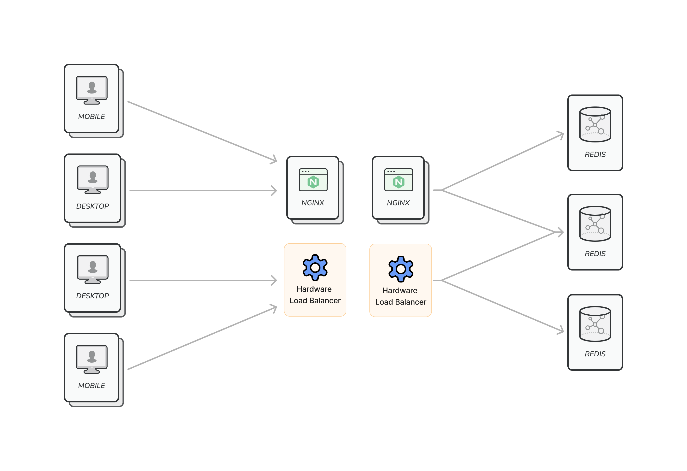
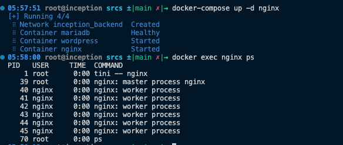

# NGINX

## Quick Links
- [Server Configuration for ghan.42.fr](../../srcs/services/nginx/configs/servers/ghan.42.fr.conf)
- [Dockerfile for NGINX Image](../../srcs/services/nginx/Dockerfile)
- [NGINX Container's Entrypoint Shell Script](../../srcs/services/nginx/nginx_entrypoint.sh)
- [Docker Compose for Inception](../../srcs/docker-compose.yml)

## Introduction
- NGINX is a popular open source HTTP and reverse proxy server, which was originally written by, a Russian engineer, [Igor Sysoev](http://sysoev.ru/en/). It can also be set up to function as a mail proxy server, and a TCP/UDP proxy server.
- In addition to the basic feature of serving static and index files, NGINX provides caching feature and load balancing feature, with help from a paid product, NGINX Plus, as a reverse proxy server.

## NGINX as a Web Server/Proxy
- NGINX can be configured as a HTTP web server or as a reverse proxy. Refer to following guides:
  - [Configuring as a web server](https://docs.nginx.com/nginx/admin-guide/web-server/web-server/) & [serving static contents](https://docs.nginx.com/nginx/admin-guide/web-server/serving-static-content/)
  - [Configuring reverse proxy](https://docs.nginx.com/nginx/admin-guide/web-server/reverse-proxy/)
- Refer to following links for setting up NGINX as Wordpress's fastcgi proxy:
  - Setting up NGINX and Wordpress [by NGINX](https://www.nginx.com/resources/wiki/start/topics/recipes/wordpress/) and [by Wordpress](https://wordpress.org/support/article/nginx/)

### Setting up a TLS layer
<!-- TODO -->

## NGINX as a Load Balancer
- NGINX & NGINX Plus can be configured to act as a proxy that distributes requests to pools of multiple web/application servers, under a certain policy, to prevent overloading some servers while there are some idle servers.
  <figure>
    <p align="center">
    
    </p>
  </figure>
- NGINX can replace hardware load balancers or be used in parallel or in series with them. Moving the role of load balancing from physical to logical realm makes load balancing more easy-to-control and cost effective.
- Read how NGINX promotes their load balancing feature from [this blog article](https://www.nginx.com/blog/nginx-load-balance-deployment-models/).
- The way to configure NGINX as a load balancing proxy server and possible options are explained in [this link](https://docs.nginx.com/nginx/admin-guide/load-balancer/http-load-balancer/).

## Installing NGINX
- In Linux distributions, NGINX can be installed via their package managers.
	```bash
	apk update && apk add nginx (Alpine Linux)
	```
- But, often the version the package mangers provide are not the latest stable version. In order to install the latest stable version from the repository, provided by NGINX, follow instructions on [this link](http://nginx.org/en/linux_packages.html).

## Run, Control & Test NGINX
### Run
- Once the software is installed and configuration is ready, NGINX can be started by simply running the executable file.
- When NGINX is run, a master process spawns a number of worker processes. Note that the master process is run as the system's root user and the workers are run as nginx.
	<figure>
		<p align="center">
			
		</p>
	</figure>
  
  - Exposing services that have root access is not recommended for security reasons. However, the root access is necessary to bind to ports that range from 1-1024. Therefore, the master process needs to be run as the root, but by running the workers as non-root user, entrypoints to the root access are hidden. (Check out [this discussion](https://unix.stackexchange.com/questions/134301/why-does-nginx-starts-process-as-root).)
  - The master process's role is to read and evaluate configration files, and to maintain the worker processes.
  - The worker processes distribute connections a server/servers need to handle among themselves such that workload can be distributed to multiple processes. Running multiple processes also increase the amount of system resources a service can utilize (such as file descriptors).
- When running 

### Control
- By passing `-s` option with a specific `<SIGNAL>`, ab administrator can control a running NGINX service.
  ```bash
	nginx -s <SIGNAL>
  ```
- `<SIGNAL>` can be one of the following:
  - quit – Shut down gracefully (the SIGQUIT signal)
  - reload – Reload the configuration file (the SIGHUP signal)
  - reopen – Reopen log files (the SIGUSR1 signal)
  - stop – Shut down immediately (or fast shutdown, the SIGTERM singal)

### Graceful Shutdown
- Note that`SIGQUIT` is the signal that shuts down the service gracefully. When running NGINX inside docker containers, `STOPSIGNAL` must be changed to `SIGQUIT` such that the container will stop gracefully when `docker stop` is run.
  - In this project `STOPSIGNAL` was set by using `stop_signal` directive in [docker-compose.yml](../../srcs/docker-compose.yml).
	```yaml
    ...

	volumes:
      - wp_resources:/var/www/ghan.42.fr
    stop_signal: SIGQUIT
    restart: on-failure
	
    ...
	```

### Test
- After making changes to configuration files, NGINX can be tested by running `nginx -t`. Configuration syntax and availability of files referred in configuration are tested.

## References
- [nginx.org. (n.d.). nginx. [online]](https://nginx.org/en/)
- [Rick Nelson. (2019). Load Balancing Deployment Scenarios with NGINX. [online]](http://nginx.org/en/linux_packages.html)
- [Unix & Linux Stack Exchange. (n.d.). Why does nginx starts process as root? [online]](https://unix.stackexchange.com/questions/134301/why-does-nginx-starts-process-as-root)
- [www.nginx.com. (n.d.). CommandLine | NGINX. [online]](https://www.nginx.com/resources/wiki/start/topics/tutorials/commandline/)
- [nginx.org. (n.d.). Controlling nginx. [online]](http://nginx.org/en/docs/control.html)
- [Meghna Gangwar. (n.d.). Nginx location directive examples | DigitalOcean. [online]](https://www.digitalocean.com/community/tutorials/nginx-location-directive)