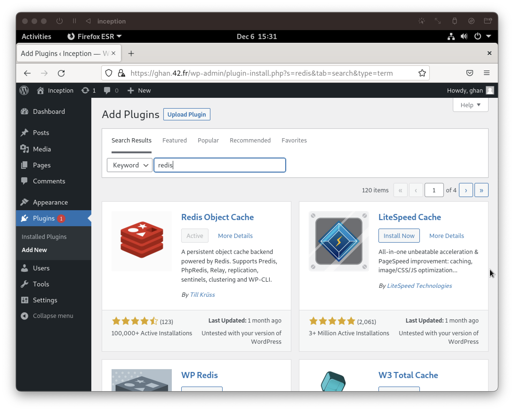

# Redis

## Introduction
- "Redis is an open source (BSD licensed), in-memory data structure store used as a database, cache, message broker, and streaming engine." - Redis Website.
- Redis stores data as key-value pairs and provides various data structures such as strings, lists, sets, sorted sets, etc.
- By either using `RDB(Redis Database)`, `AOF(Append Only File)`, or both, Redis can be used as a persistent data storage. There are trade-offs of each of these two techniques. To further investigate on this topic, refer to [this page](https://redis.io/docs/management/persistence/).
- The project was started by `Salvatore Sanfilippo`(http://invece.org/) in 2009.

## Quick Links
- [Redis Configuration for Inception - /etc/my.cnf](../../srcs/services/redis/configs/my.cnf)
- [Dockerfile for Redis Image](../../srcs/services/redis/Dockerfile)
- [Redis Container's Entrypoint Shell Script](../../srcs/services/redis/db_entrypoint.sh)
- [Docker Compose for Inception](../../srcs/docker-compose.yml)

## Installation
- In Alpine Linux, Redis can be easily installed via the `apk` package manager.
  ```shell
  apk update && apk add redis
  ```

## Configuration
- After installation a configuration file, `/etc/redis.conf`, is automatically created.
- It is also possible to set one-time options by passing arguments via the command line when starting the server instance. Following is an example.
  ```shell
  # listen via port 6380
  redis-server --port 6380
  ```
- In order to allow access from the remote by TCP, from the Wordpress container in case of this project, the IP address of the Redis container is appended to the `bind` option. By default, only loopback addresses are set to be bound.
  ```shell
  # redis.conf
  # 172.18.0.6 is the IP of the Redis container.
  # Remote machines that share the same LAN
  # can connect to the server at 172.18.0.6:6379

  bind 127.0.0.1 172.18.0.6
  
  port 6379 # default port for an instance of Redis server
  ```
- If no password is configured, even though addresses are explicitly set, only loopback addresses are allowed to be bound.
  - This is due to the option, `portected-mode`, which is enabled by default.
    ```shell
    # redis.conf

    protected-mode (yes/no) 
    ```
  - A password to access the server can be set by the directive, `requirepass`. In this project, the password is set by passing arguments in order to receive the password via an environment variable, `redis-server [path to a configuration file] --requirepass $REDIS_PASSWD`.
    ```shell
    # redis.conf

    requirepass (password) 
    ```
- In order to configure `RDB` feature, refer to the "SNAPSHOTTING" section of [`redis.conf`](../../srcs/services/redis/configs/redis.conf). In order to configure `AOF` feature, refer to the "APPEND ONLY MODE" section of [`redis.conf`](../../srcs/services/redis/configs/redis.conf).
- To run the server as a foreground process in a container environment, `daemonize` option must be set to "no". By default, Redis does not run as a background process.
- Read [this link](https://redis.io/docs/management/config/) for more options and details.

## Run
- An instance of Redis server can be run by executing `redis-server`. Settings that are defined in a configuration file can be applied by passing the path of the file as an argument.
  ```shell
  redis-server /etc/redis.conf --requirepass $REDIS_PASSWD
  ```
- For security reasons, it is not recommended to run `redis-server` as the system root user. When Redis is installed, a system user, `redis`, is created and it is recommended to run the server as the user. Unless, a client may remove or corrupt important files by using `CONFIG` command.
  - In this project `su-exec` was used to run the server as `redis` in the container environment.
- Clients can connect to the server, interact, and modify data via `redis-cli` command.
  - Setting a key-value pair and getting the value by key.
  <figure>
    <p align="center">
      
    </p>
  </figure>

  - Continuous connection status can be monitored by `redis-cli --stat` command.
  <figure>
    <p align="center">
      
    </p>
  </figure>

  - For further details on `redis-cli`, refer to [this link](https://redis.io/docs/manual/cli/).
  
- Health of the server can be tested by `redis-cli PING` command. If the server is up and healthy, the command outputs `PONG` with an exit code 0, otherwise error message with an exit code 1.
  ```dockerfile
  HEALTHCHECK --start-period=2s --interval=5s --retries=5 CMD redis-cli -a $REDIS_PASSWD PING
  ```
  - Since an instance of redis server is set to run as a cache storage for Wordpress, in `docker-compose.yml`, Wordpress container is configured to run after health check of the redis-server succeeds.
  ```yaml
  # wordpress section of docker-compose.yml
  # wordpress container depends on healthiness of mariadb and redis containers.
  depends_on:
    mariadb:
      condition: service_healthy
    redis:
      condition: service_healthy
  ```

## Connecting with Wordpress
- [Redis Object Cache](https://wordpress.org/plugins/redis-cache/#description) plugin for Wordpress offers an easy-to-use persistent cache backend for Wordpress websites.
- It can be installed on the plugin section of `/wp-admin/` page via web browsers.
  <figure>
    <p align="center">
      
    </p>
  </figure>

- Wordpress plugins can be installed, activated, and configured also via command line interface by using `wp-cli`. Installation, activation and configuration of connection parameters for the Redis plugin is performed in [the entrypoint shell script](../../srcs/services/wordpress/wp_entrypoint.sh) for the Wordpress container.
  ```shell
  # wp_entrypoint.sh
  # following lists of commands install, configure and activate the plugin
  
  wp plugin install --activate redis-cache \
	&& wp config set WP_REDIS_HOST $REDIS_HOST \
	&& wp config set WP_REDIS_PASSWORD $REDIS_PASSWD \
	&& wp redis enable
  ```
  - Some [connection parameters](https://github.com/rhubarbgroup/redis-cache/wiki/Connection-Parameters) are required to be set in the `wp-config.php` to enable connection between the Redis container and the Wordpress container.
  > The Redis server must be running at `$REDIS_HOST` before running these commands in the Wordpress container.
- After enabling the plugin, status of the plugin can be checked by running `wp redis status` command in Wordpress's root directory.
  <figure>
    <p align="center">
      
    </p>
  </figure>

- It is possible to check that caches are piling by displaying all keys by `KEYS *` command in `redis-cli` after making a few requests on the Wordpress website.
  <figure>
    <p align="center">
      
    </p>
  </figure>

## References
- [Redis. (n.d.). Introduction to Redis. [online]](https://redis.io/docs/about/)
- [Redis. (n.d.). Redis CLI. [online]](https://redis.io/docs/manual/cli/)
- [Redis. (n.d.). Redis configuration. [online]](https://redis.io/docs/management/config/)
- [Redis. (n.d.). Redis security. [online]](https://redis.io/docs/management/security/)
- [Redis. (n.d.). Redis persistence. [online]](https://redis.io/docs/management/persistence/)
- [Krüss, T. (n.d.). Redis Object Cache. [online]](https://wordpress.org/plugins/redis-cache/#description)
- [WordPress Developer Resources. (n.d.). wp plugin install | WP-CLI Command. [online]](https://developer.wordpress.org/cli/commands/plugin/install/)
- [WordPress Developer Resources. (n.d.). wp config set | WP-CLI Command. [online]](https://developer.wordpress.org/cli/commands/config/set/)
- [GitHub. (n.d.). WP CLI Commands · rhubarbgroup/redis-cache Wiki. [online]](https://github.com/rhubarbgroup/redis-cache/wiki/WP-CLI-Commands)
- [GitHub. (n.d.). Connection Parameters · rhubarbgroup/redis-cache Wiki. [online]](https://github.com/rhubarbgroup/redis-cache/wiki/Connection-Parameters)
- [GitHub. (n.d.). Installation · rhubarbgroup/redis-cache Wiki. [online]](https://github.com/rhubarbgroup/redis-cache/wiki/Installation)