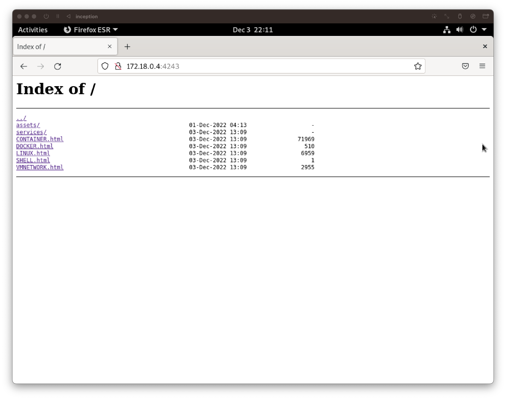

# Static Website

## Quick Links
- [Dockerfile for Static Webpage Image](../../srcs/services/static_www/Dockerfile)
- [Static Webpage Container's Entrypoint Shell Script](../../srcs/services/static_www/static_entrypoint.sh)

## Summary
- A static website is created by converting markdown documentation pages of this project to html documents.
- `pandoc` is used to convert markdown files to html documents. `pandoc` is a Haskell library written by John MacFarlane. It supports converting frome one markup format to another.
  ```bash
  pandoc $SOURCE -f $FROM_MARKUP -t $TO_MARKUP -o $TARGET
  ```
- `pandoc` can be downloaded from github.
  ```bash
  curl -LO https://github.com/jgm/pandoc/releases/download/2.19.2/pandoc-2.19.2-linux-$TARGETARCH.tar.gz
  ```
- The newly created html files are stored in `/var/www/static` which is a directory mounted as a volume and shared to the NGINX container.
  ```yaml
  # docker-compose.yml
  # nginx container volumes configuration
  volumes:
    - wp_resources:/var/www/ghan.42.fr
    - adminer_resources:/var/www/adminer
    - static_resources:/var/www/static

  # static_www container volumes configuration
  volumes:
    - static_resources:/var/www/static
  ```

- The NGINX server listening on the port will serve the static resources upon request. The NGINX server is configured as below.
  ```
  server {
    listen   4243;
    server_name  static;
    
    access_log  /var/log/nginx/static.log  main;

    root /var/www/static;

    location / {
        autoindex on;
    }
  }

  ```
- The `autoindex` feature of NGINX was utilized to display file tree on web browsers.
  <figure>
      <p align="center">
        
      </p>
  </figure>

> Note that the container for the static webpage does not need to expose a port to other containers since it dies right after creating html files unlike other services.

## Reference
- [pandoc.org. (n.d.). Pandoc - Pandoc User’s Guide. [online]](https://pandoc.org/MANUAL.html)
- [GitHub. (n.d.). Release pandoc 2.19.2 · jgm/pandoc.](https://github.com/jgm/pandoc/releases/tag/2.19.2)