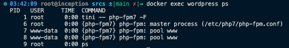
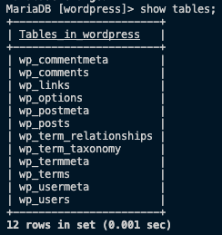
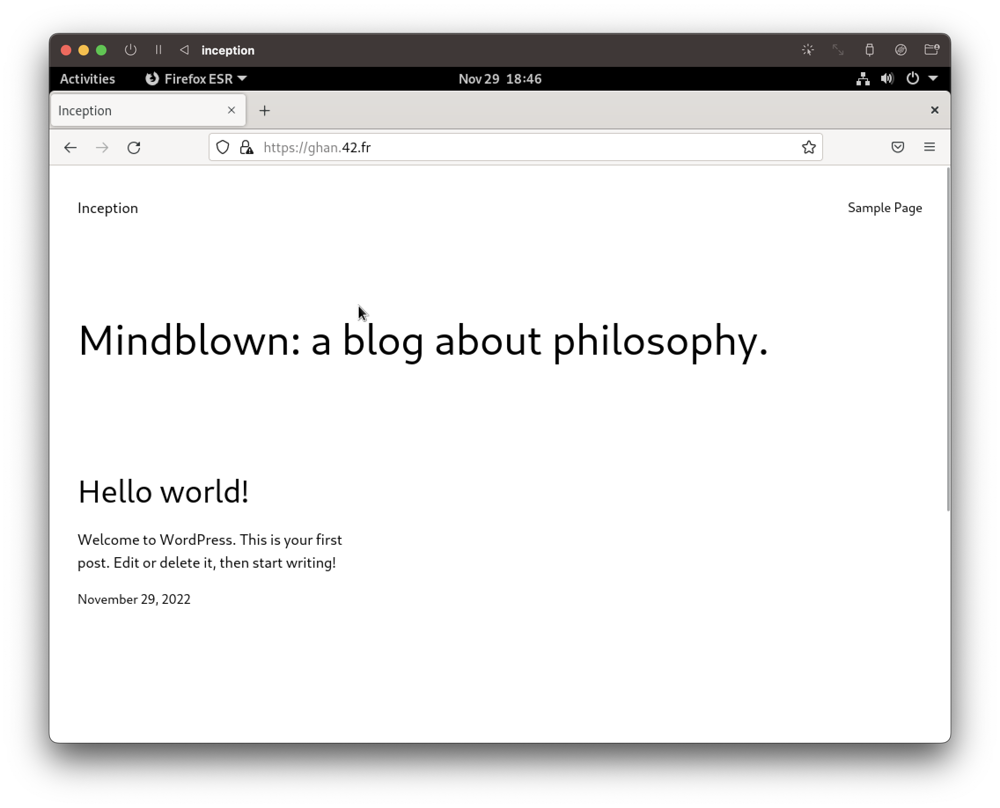
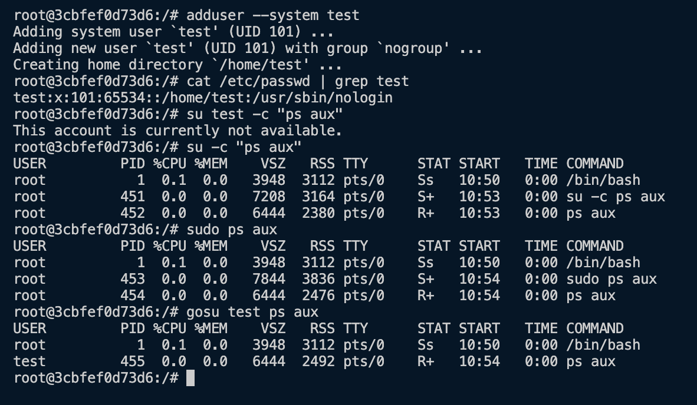

# Wordpress
## Introduction
- [Wordpress](https://wordpress.org/) is a free open-source software that provides tools and resources to create, customize and publish websites, blogs and applications.
- It is written in PHP and paired with a database system, MySQL or MariaDB. Following is the recommended requirements to run Wordpress:
  - PHP version 7.4 or greater.
  - MySQL version 5.7 or greater/MariaDB version 10.3 or greater.
  - HTTPS support

## Quick Link
- [`php-fpm` Configuration](../../srcs/services/wordpress/configs/php.ini)
- [Wordpress Configuration](../../srcs/services/wordpress/configs/www.conf)
- [Dockerfile for wordpress Image](../../srcs/services/wordpress/Dockerfile)
- [Wordpress Container's Entrypoint Shell Script](../../srcs/services/wordpress/wp_entrypoint.sh)
- [Docker Compose for Inception](../../srcs/docker-compose.yml)

## Setting Up
### PHP
- PHP is a script language that focuses on server-side scripting, but it can be also used for command line scripting or writing desktop applications.
- PHP and some libraries need to be installed by a package manager.
	```bash
	apk update \
	&& apk add php7=7.4.33-r0 \ # PHP
	php7-fpm=7.4.33-r0 \ # FastCGI Process Manager (FPM)
	php7-opcache=7.4.33-r0 \ # PHP cache system
	php7-gd=7.4.33-r0 \ # Create, manipulate, output image files
	php7-mysqli=7.4.33-r0 \ # MySQL Improved Extension
	php7-curl=7.4.33-r0 \ # libcurl, http, https, ftp, gopher, telnet, etc.
	php7-phar=7.4.33-r0 \ # PHP Archive for easy distribution and installation
	php7-json=7.4.33-r0 \ # JSON support
	php7-iconv=7.4.33-r0 # Character encoding converter
	```
	> Package managers may not support the latest stable version. It is possible to download the source and build it. But, such a way is not suitable for container environment because it takes too long to compile.
### `PHP-FPM`
- `php-fpm` is a PHP FastCGI implementation. It supports:
  - process management with graceful stop/start;
  - start workers with different environment settings;
  - stdout & stderr logging; etc.
- It runs multiple workers and has a master process that maintains these workers. Note that the master process is run as the root, but the workers as www-data, as is configured in the [www.conf](../../srcs/services/wordpress/configs/www.conf) for security reasons.
  <figure>
    <p align="center">
    
    </p>
  </figure>

  - The number and behaviour of worker processes can be configured. Refer to the commented guide below.
    ```
    ; Choose how the process manager will control the number of child processes.
    ; Possible Values:
    ;   static  - a fixed number (pm.max_children) of child processes;
    ;   dynamic - the number of child processes are set dynamically based on the
    ;             following directives. With this process management, there will be
    ;             always at least 1 children.
    ;             pm.max_children      - the maximum number of children that can
    ;                                    be alive at the same time.
    ;             pm.start_servers     - the number of children created on startup.
    ;             pm.min_spare_servers - the minimum number of children in 'idle'
    ;                                    state (waiting to process). If the number
    ;                                    of 'idle' processes is less than this
    ;                                    number then some children will be created.
    ;             pm.max_spare_servers - the maximum number of children in 'idle'
    ;                                    state (waiting to process). If the number
    ;                                    of 'idle' processes is greater than this
    ;                                    number then some children will be killed.
    ;  ondemand - no children are created at startup. Children will be forked when
    ;             new requests will connect. The following parameter are used:
    ;             pm.max_children           - the maximum number of children that
    ;                                         can be alive at the same time.
    ;             pm.process_idle_timeout   - The number of seconds after which
    ;                                         an idle process will be killed.
    ; Note: This value is mandatory.
    ```
- In this project, since `php-fpm` is expected to communicate with the NGINX container only, it is configured to bind the listening socket to the specific address that is on the same LAN as the NGINX container, and is allowed to listen only the requests from the IP address of the NGINX container.
  ```
  ; part of www.conf
  ; Bind to the IP address which is on the same LAN as the NGINX container (172.18.0.4)
  listen = 172.18.0.3:9000

  ; Allow to listen requests from the NGINX container only
  listen.allowed_clients = 172.18.0.4
  ```
> In order to run `php-fpm` as a foreground process that keeps a container running, it must be started with a `-F` option which is the same as `--nodaemonize`.

#### FastCGI
- FastCGI is the next generation to the Common Gateway Protocol ([CGI](https://www.rfc-editor.org/rfc/rfc3875)).
- Two major differences are:
  - The CGI process does not terminate everytime after returing output data. Instead, it waits for the next request.
  - Supports remote access, does not need to run on the same host as the web server.
- These changes reduces server load, and time (does not need to start the script every single time) and resource consumption (processes are not required to be forked as many time as the script is requested).

### MySQL
- A MySQL or MariaDB server stores contents of the websites, such as posts and comments, and user data.
- The database server must be accessibe by `php-fpm` (either running in local host or the Wordpress app must access the database as a user that has remote access to the database).
- `mysql-client` package must be installed in the Wordpress container.
  ```bash
  apk add mysql-client
  ```
- Below is the list of tables in the default Wordpress database.
  <figure>
    <p align="center">
    
    </p>
  </figure>

### Web Server (NGINX/Apache or else)
- In this project, NGINX is configured as a web server that sits before `php-fpm` application to receive requests from clients and pass it to the application in accordance with CGI protocol.
    ```
    location ~ \.php$ {
      # NOTE: You should have "cgi.fix_pathinfo = 0;" in php.ini
      include /etc/nginx/fastcgi.conf;
      fastcgi_intercept_errors on;
      fastcgi_pass 172.18.0.3:9000;
    }
    ```

  - The location block configuration above shows that any request for php script will be passed to the FastCGI server in the Wordpress container and CGI meta-variables will be set as are defined in `/etc/nginx/fastcgi.conf`.
- NGINX needs to set up TLS layer to ensure secure connection between the client and the Wordpress application. Refer to [TLS section on NGINX](NGINX.md#setting-up-a-tls-layer).

## Installing and Configuring Wordpress
- Once the database, the web server, and the FastCGI server is set, the Wordpress needs to be installed and configured, such that the scripts can communicate with the services.
- Wordpress can be downloaded and extracted by the commands below.
  ```bash
    curl -O https://wordpress.org/latest.tar.gz
    tar -xzvf latest.tar.gz
  ```
- Then, Wordpress can be configured by editting `wp-config.php` or by loading `wp-admin/setup-config.php` in the web browser.
- But, in this project, [`wp-cli`](https://make.wordpress.org/cli/) was used to install and configure Wordpress in CLI environment inside a docker container.

### `wp-cli`
- `wp-cli` is the command line tool for managing Wordpress sites.
- The recommended way to install is by downloading the `Phar` (PHP archive) build. (`php7-phar` needs to be installed to run the command).
  ```bash
  # Download wp-cli.phar
  curl -O https://raw.githubusercontent.com/wp-cli/builds/gh-pages/phar/wp-cli.phar

  # Make the file executable and rename it as wp
  chmod +x wp-cli.phar
  mv wp-cli.phar /usr/local/bin/wp

  # Check if it works
  wp --info
  ```
- Then, the latest version of Wordpress can be downloaded by running a following command. Read [this document](https://developer.wordpress.org/cli/commands/core/download/) for details about options.
  ```bash
  wp core download --path={where Wordpress will be downloaded}
  ```
- After changing directory to the root of Wordpress, create and configure `wp-config.php`. Read [this document](https://developer.wordpress.org/cli/commands/config/create/) for details about options.
  ```bash
  wp config create --dbhost={database host} --dbname={database name} --dbuser={database user}--dbpass={databse password}
  ```
- Create the database based on `wp-config.php`. `wp-cli` will connect to the database server and try to create Wordpress database and set up necessary tables. `mysql-client` must have been installed, and if the connection is remote, the database user must have permissions for remote access. Read [this document](https://developer.wordpress.org/cli/commands/db/create/) for details about options.
  ```bash
  wp db create
  ```
- Install Wordpress. Read [this document](https://developer.wordpress.org/cli/commands/core/install/) for details about options.
  ```bash
  wp core install --url={wp site url} --title={page title} --admin_user={admin user} --admin_password={admin password} --admin_email={admin email}
  ```
- Wordpress website will be able to be accessed by the hosting NGINX server's name or its IP address (if everything was done properly...).
  <figure>
    <p align="center">
    
    </p>
  </figure>
- The full list of `wp-cli` commands can be found in [this link](https://developer.wordpress.org/cli/commands/).
> It is important that both the NGINX container and the Wordpress container must be able to access Wordpress scripts. (docker volume was used in this project.)

#### Do Not Run `wp-cli` as Root!
- It is not recommended to run `wp-cli` commands as the system's root user for security reasons. Read [this discussion](https://github.com/wp-cli/wp-cli/pull/973) for further details.
- In this project, in order to avoid running `wp-cli` as root in a container, [`su-exec`](https://github.com/ncopa/su-exec) is used to run `wp-cli` commands as a system user `www-data`. 
  > [`gosu`](https://github.com/tianon/gosu) is an alternative command for `su-exec`, but `gosu` is slightly more heavier and cannot be installed via `apk` in Alpine Linux while `su-exec` can. There were 2.3MB difference between the final image that used `gosu` and the other one that used `su-exec`.
- At first, `su` with `-c` option was tried, but since `su` requires tty connection, it was not possible to run as a system user that does not have a loginable shell.
- `gosu` and `su-exec` uses `exec` internally after switching the user as requested. It does not require TTY connection and has no signal-forwarding issue like `su` or `sudo`.
  > Note that `su` or `sudo` may cause siganl-forwarding issue inside a container, since they `fork` before `exec` while `gosu` and `su-exec` do not.
  <figure>
    <p align="center">
    
    </p>
  </figure>
  

## Reference
- [www.php.net. (n.d.). PHP: FastCGI Process Manager (FPM) - Manual. [online]](https://www.php.net/manual/en/install.fpm.php)
- [www.php.net. (n.d.). PHP: Nginx 1.4.x on Unix systems - Manual. [online]](https://www.php.net/manual/en/install.unix.nginx.php)
- [www.php.net. (n.d.). PHP: Description of core php.ini directives - Manual. [online]](https://www.php.net/manual/en/ini.core.php#ini.cgi.fix-pathinfo)
- [www.php.net. (n.d.). PHP: Configuration - Manual. [online]](https://www.php.net/manual/en/install.fpm.configuration.php)
- [WP-CLI. (2017). Installing. [online]](https://make.wordpress.org/cli/handbook/guides/installing/)
- [WP-CLI. (2017). Quick Start. [online]](https://make.wordpress.org/cli/handbook/guides/quick-start/#practical-examples)
- [help.superhosting.bg. (2016). What is CGI, FastCGI? [online]](https://help.superhosting.bg/en/cgi-common-gateway-interface-fastcgi.html)